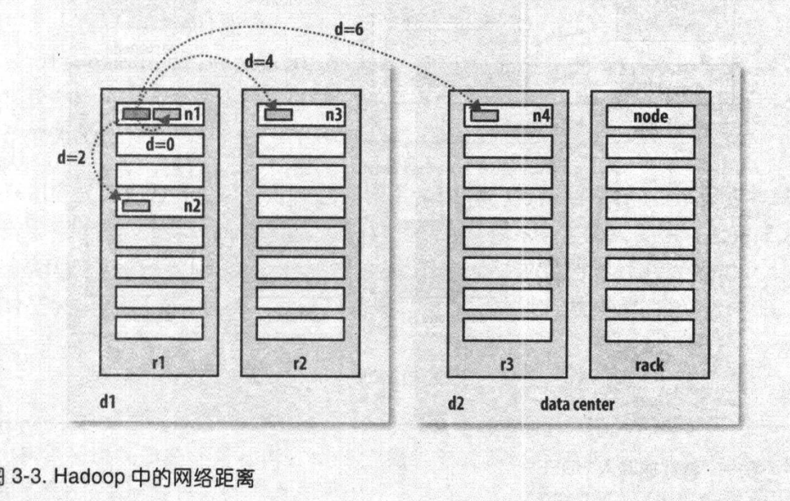
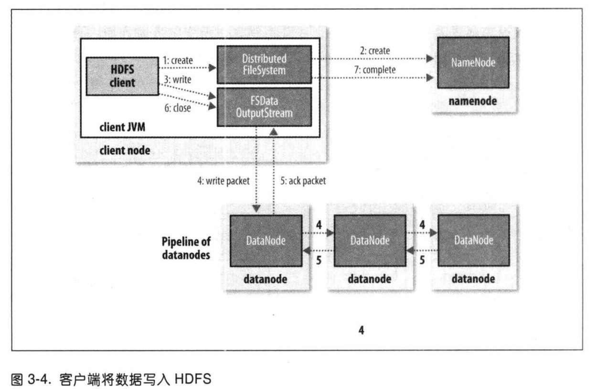

# HDFS

全称HADOOP DISTRIBUTED FILE SYSTEM，简称**HDFS**，是一个分布式文件系统。

## HDFS的设计目标

HDFS是以流式数据访问模式来存储超大文件，运行于商用硬件集群上。

* 超大型"文件"：上百G、上百T大小的文件
* 流式数据访问：一次写入、多次读取，读取整个数据集的时间延迟比读取第一条记录的时间延迟更重要。
* 商用硬件：它是设计运行在商用的普通硬件集群上的，故障几率相对较高，遇到故障时，需要设计成能够继续运行且不让用户察觉到明显的中断。
* 低时间延迟的数据访问：但是HDFS是为高数据吞吐量应用的优化，可能会议提高时间延迟为代价。所以低延迟的访问需求，HDFS并不合适。
* 大量的小文件：文件系统的元数据存储在namenode的内存中，因此文件系统能够储存文件的总数受限于namenode的内容容量。eg：每个文件、目录和数据块的存储信息大约150字节，如果有一百万个文件，每个文件占一个数据块，需要$150 * 1000000 / 1024 / 1024 = 143M$的内存。
* 多用户写入，任意修改文件：HDFS文件写入只支持单个写入者，通过append方式在文件末尾写入数据，不支持在文件任意位置修改。

## HDFS的概念

### 数据块

HDFS的数据块默认大小为128M，HDFS上的文件按块大小进行划分为多个分块，作为独立存储单元。HDFS中小于一个块大小的文件不会占据整个块的空间（一个1M的文件存储在128M的块中时，文件只使用1M的磁盘空间）。

HDFS数据块较大，目的是为了最小化寻址开销。如果块比较大，从磁盘传输数据的时间明显大于定位数据块开始位置所需的时间，所以传输一个由多个块组成的大文件的时间取决于磁盘传输速率。

数据块大小也不宜设置得过大，MapReduce的map任务通常一次只处理一个块中的数据，如果任务数太少（少于分配的节点数量），作业运行速度就会较慢。

#### 数据块的优点

1. 文件的大小可以大于网络中任意一个磁盘的容量，文件的所有块不需要存储在一个磁盘上面，可以使用集群上任意一个磁盘进行存储。
2. 简化存储子系统的设计，块的大小固定，计算磁盘存储块的数量相对容易，文件的元数据（权限信息等），不需要与块一同存储。
3. 用于数据备份，提高数据容错能力和提高可用性，将块复制到几个物理上相互独立的机器上（3个），一个因损坏或机器故障而丢失的块可以从其他候选地点复制到正常运行的机器上。

HDFS中可以使用fsck指令显示块信息。

### namenode和datanode

一个namenode（管理节点）：管理文件系统的命名空间，维护文件系统树及树内所有的文件和目录，以命名空间镜像文件和编辑日志文件的形式永久保存在磁盘上。namenode记录每个文件各个块所在数据节点的信息，但并不永久保存块的位置信息，因为位置信息会在系统启动时根据数据节点信息重建。

datanode是文件系统的工作节点，受namenode或client调度，根据需要存储并检索数据块，定期向namenode发送所存储的块的列表。由此可见namenode的重要性。

Hadoop提供了两种namenode的容错机制：

1. 备份那些组成文件系统元数据持久状态的文件，也就是写入本地磁盘的同时写入远程挂载的网络文件系统（NFS）
2. 运行一个辅助的namenode，作用是定期合并编辑日志与命名空间镜像，防止编辑日志过大。但是辅助namenode保存的状态总是滞后于主namenode，可能会丢失部分数据，一般通过把存储在NFS上的namenode元数据复制到辅助namenode中，作为主namnode继续运行。

### 块缓存

通常datanode从磁盘中读取块，但对于频繁访问的文件，块可以被缓存在datanode的内存中，以堆外块缓存（off-heap block cache）的形式存在。作业调度器（MapReduce、Spark等）通过在缓存块的datanode上运行任务，提高读操作的性能，例如，join操作使用的是一个子查询表，就可以通过缓存加速。

### 联邦HDFS

namenode的内存是限制系统横向扩展的瓶颈，联邦HDFS允许系统添加namenode实现扩展，每个namenode管理文件系统命名空间中的一部分，例如，一个namenode管理/user目录下的所有文件，另一个管理/share下的所有文件。

在联邦环境下，每个namenode维护一个命名空间卷（namespace volume），它是有命名空间的元数据和一个数据块池组成，数据块池包含命名空间下的文件的所有数据块，命名空间卷之间是相互独立的，一个失效不会影响另一个。

### HDFS高可用性

如果namenode失效了，Hadoop系统无法提供服务直到有新的namenode上线。

新的namenode要满足以下情况才能响应服务：

1. 将命名空间中的映像导入内存中
2. 重演编辑日志
3. 接受到足够多来自datanode的数据块报告并退出安全模式

大型集群namenode冷启动需要30min或更长。

Hadoop2使用备用namenode：

* 当备用namenode接管工作后，会通读共享编辑日志，与前任namenode同步，继续执行。
* datanode需要同时向两个namenode发送数据块报告
* 备用namenode为活动的namenode命名空间设置周期性检查点

在活动的namenode时效后，备用namenode能够快速实现任务接管。

在活动namenode失效且备用namenode也失效的情况，就需要进行冷启动了。

故障转移控制器（failover controller），管理将活动namenode转移为备用namenode的转换过程，通过心跳机制监控namenode是否失效，失效时进行故障切换。

## 数据流

### 文件读取

1. HDFS通过DistributedFileSystem的实例调用open来打开要读取的数据（步骤1）
2. DistributedFileSystem通过使用远程过程调用（RPC）来调用namenode，确定文件起始块的位置，namenode返回存有该块的datanode的地址（步骤2）
3. DistributedFileSystem会返回FSDataInputStream对象给客户端来读取数据（步骤3）
4. FSDataInputStream会封装DFSInputStream对象，来管理datanode和namenode的I/O
5. DFSInputStream连接datanode调用read读取数据（步骤4），会根据需要询问namenode来检索下一批数据块的datanode的位置，继续读取（步骤5）
6. 客户端完成读取，调用close（步骤6）

如果DFSInputStream与datanode通信时遇到错误，会尝试找另一个最邻近的datanode读取数据，而且它会记住故障的datanode，保证不会反复读取该节点上的块。

Hadoop中不同节点的距离度量（数据中心用d表示，机架用r表示，界定用n表示）：

* 在同一节点上的进程 distance（/d1/r1/n1，/d1/r1/n1）= 0
* 同一机架上的不同节点 distance（/d1/r1/n1，/d1/r1/n2）= 2
* 同一数据中心中不同机架上的节点 distance（/d1/r1/n1，/d1/r2/n3）= 4
* 不同数据中心中的节点 distance（/d1/r1/n1，/d2/r3/n4）= 6

### 文件写入

1. 客户端通过调用对DistributedFileSystem对象调用create()新建文件（步骤1）
2. DistributedFileSystem对namenode创建RPC调用，namenode会执行各种检查确保文件不存在和鉴权等，检查通过系统的命名空间中新建文件（步骤2）
3. DistributedFileSystem向客户端返回DFSDataOutputStream对象，负责处理datanode和namenode之间的通信，客户端通过调用write写入数据（步骤3）
4. DFSDataOutputStream将数据分成数据包，写入数据队列中，DataStreamer向namenode请求datanode，根据复本数（默认为3）发送到datanode pipeline存储和转移数据包（步骤4）。
5. DFSDataOutputStream还维护一个确认队列，收到pipeline中所有datanode确认消息后，才会删除数据包（步骤5）
6. 客户端完成数据写入后，对DFSDataOutputStream调用close()方法（步骤6）
7. 通知namenode完成文件写入基本完成，即达到了最小副本数1（步骤7）

## Quiz

1. namenode和datanode各自的功能
2. HDFS的高可用性中，当活动的namenode失效，备用namenode会有哪有操作
3. HDFS数据的读取和写入过程的链路是怎样的

