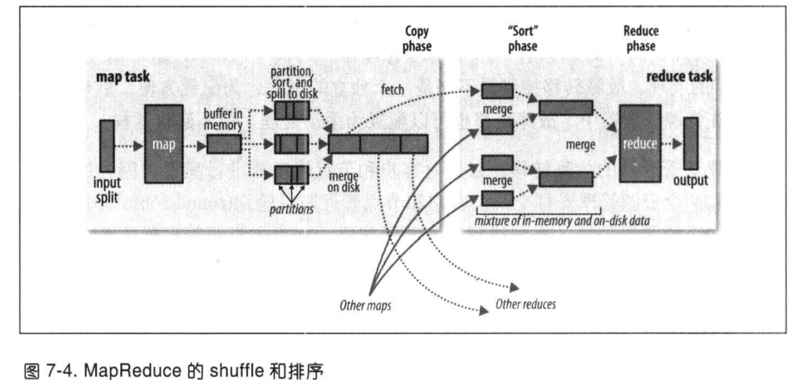

# MapReduce

### MapReduce基本定义

MapReduce是面向大数据并行处理的计算模型、框架和平台。

* MapReduce是一个基于集群的高性能并行计算平台（Cluster Infrastructure）
* MapReduce是一个并行计算运行的软件框架（Software Framework）
* MapReduce是一个并行程序设计模型与方法（Programming Model）

### MapReduce模型简介

* MapReduce将复杂的、运行于大规模集群上的并行计算过程高度抽象成了两个函数：Map和Reduce，现实世界中大部分任务都可以抽象成map和reduce
* MapReduce采用分而治之的策略，存储在HDFS的大规模数据集，按照数据块切分成多个map任务并行处理
* 易于编程、高扩展性、高容错性

### Map和Reduce函数

|        | 输入           | 输出         |
| ------ | -------------- | ------------ |
| Map    | (k1, v1)       | List(k2, v2) |
| Reduce | (k2, List(v2)) | (k3, v3)     |

* 将数据集解析成一批kv对，用map进行处理

* 每一个kv对会输出一批新的kv作为中间结果

例如，word count的一个过程，map输入（行号，"a a a"），输出List(("a", 1), ("a", 1), ("a", 1))；reduce输入（"a", (1, 1, 1)）输出（"a", 3）。

## MapReduce作业运行机制

整个MapReduce作业的运行过程如下图所示：

图中包含5个主要的部分：

* 客户端，用于提交MapReduce作业
* YARN的资源管理器（ResourceManager），负责集群资源的分配
* YARN的节点管理器（NodeManager），负责启动和监控集群中机器上的容器（container）
* Application Master，负责协调运行MapReduce作业的任务，它和MapReduce任务都在容器中运行，这些容器由资源管理器分配并由节点管理器管理。
* 分布式文件系统（HDFS），用于各部分之间作业文件共享。

### 作业提交

Job的submit()方法创建一个内部的JobSubmitter实例，调用其submitJobInternal()方法（图中步骤1）。提交作业后，waitForCompletion()方法内部每秒查询作业进度，更新进度到控制台。

JobSubmitter实现作业提交过程：

1. 向资源管理器申请一个新的Application ID，作为MapReduce作业ID（步骤2）
2. 检查作业的输出（作业校验）。例如没有指定输出目录或输出目录已经存在，不提交作业，MapReduce抛出错误
3. 计算作业的输入分片（作业校验）。如果不能计算分片（比如输入路径不存在），不提交作业，MapReduce抛出错误
4. 拷贝执行作业需要的资源到共享文件系统的以作业ID命名的目录中（步骤3），包括Jar包、配置文件、计算好的输入切片。Jar包的副本数由mapreduce.client.submit.file.replication控制，默认是10，在运行任务的时候，节点管理器可以访问这些副本。
5. 通过资源管理器的submitApplication()方法提交作业（步骤4）

### 作业初始化

* YARN调度器为作业请求分配一个容器（步骤5a），资源管理器通过容器所在节点上的节点管理器在该容器中启动Application Master进程（步骤5b）
* MapReduce作业的Application Master是一个Java应用，主类是MRAppMaster，作用有接受任务的进度和完成报告（步骤6）；它还接收共享文件系统的、客户端计算的输入分片（步骤7）。
* 对每个分片创建map任务以及确定的多个reduce任务对象。
* 分配任务ID

### 任务分配

* Application Master为该作业中所有的map和reduce任务向资源管理器请求容器（步骤8）
* 为map任务发起的请求会首先进行，并且请求的优先级高于reduce任务，直到有5%的map任务完成，为reduce任务的请求才会发出
* reduce任务可以在集群任意位置运行，而map任务有数据本地化的限制。理想情况下，任务是数据本地化的（data local），即任务和分片在同一节点上运行。其他模式，例如机架本地化（rack local），效率会低于数据本地化。

### 任务执行

* 一旦资源管理器在一个节点上的一个容器中为一个任务分配了资源，Application Master与节点管理器通信来启动容器（步骤9）
* 任务通过一个Java应用程序执行，该程序主类是YarnChild。
* 在运行之前，需要从文件共享系统本地化任务需要的资源（jar包、配置文件等）
* 运行map或reduce任务

### 进度状态更新

一个作业和它的每个任务都有相应的状态信息，包括：作业或任务的状态（成功、失败、运行中）、map和reduce的进度、作业计数器的值、状态消息或描述等。

任务中有一组计数器，负责对任务运行过程中的事件进行计数。

当map任务或reduce任务运行时，子进程和自己的父Application Master通过接口通信。每隔一定时间，任务通过接口向Application Master报告进度和状态（通过计数器）。

在作业运行期间，客户端每秒（可通过mapreduce.client.progressmonitor.pollinterval设置）轮询一次Application Master，通过使用Job的getStatus()方法接受作业最新状态（返回JobStatus的实例，包含所有状态信息）

### 作业完成

当Application Master收到作业最后一个任务已完成的通知后，会吧作业的状态置为successfully。作业打印信息告知用户，客户端中waitForCompletion()方法返回。作业的统计信息和计数器信息输出到控制台。

作业完成，Application Master所在容器和任务所在容器清理工作状态（删除中间结果），作业信息由历史服务器存档，以便日后用户查询。

## 作业失败

在现实情况中，导致作业失败的原因可能有用户代码错误、进程崩溃、机器故障等等。

### 任务运行失败

最常见的情况是map或reduce任务中代码运行时抛出异常，此时JVM会在退出之前向其对应的Application Master发送错误报告，报告会被写进日志。Application Master将任务标记为failed，释放容器资源。

另一种情况是JVM突然退出，节点管理器会检测到进程已经退出，通知Application Master将任务标记为failed。

还有一种超时失败，当Application Master有一段时间没有收到进度更新，便会将任务标记为失败，任务的JVM进程会被kill掉，超时间隔可以通过mapreduce.task.timeout参数设置。

Application Master被告知一个任务尝试失败后，会试图避免在以前失败过的接点上重新调度该任务。（黑名单机制）

### Application Master运行失败

当作业运行失败时，Application Master可以重新尝试提交作业，但是有最大次数的限制。

Application Master会向资源管理器发送周期性的心跳，当Application Master失败时，资源管理器检测到失败后会在一个新的容器里新建Application Master实例。

### 节点管理器运行失败

与Application Master类似，节点管理器会向资源管理器发送心跳信息。如果10分钟（通过yarn.resourcemanager.nm.liveness-monitor.expiry-interval-ms设置）没有收到任何心跳信息，资源管理器就会将节点管理器从节点池中移除。

同样，如果失败次数过多，节点管理器可能会被拉黑。

### 资源管理器运行失败

资源管理器运行失败是很严重的问题，如果没有备用资源管理器，作业和任务容器将无法启动，所以为了获得高可用性，需要同时运行一对资源管理器。如果主资源管理器故障，客户端和节点管理器会反复尝试连接备用资源管理器，直到备用资源管理器变为主资源管理器。

## Shuffle

MapReduce确保每个reducer的输入都是按照键进行排序的，系统执行排序、将map输出作为输入传给reducer的过程称为shuffle。shuffle是MapReduce的"心脏"，是奇迹发生的地方。

### map端shuffle

* 每个分片数据都由一个map任务处理，处理的输出结果不会直接写到磁盘上，因为每个map任务都有一个环形内存缓冲区用于存储任务输出。缓冲区的大小有100M（通过mapreduce.task.io.sort.mb设置），当缓冲区的数据超过80%（通过mapreduce.map.sort.spill.percent设置），缓冲区的溢出结果会被写到磁盘上，生成新的溢出文件（spill file），该文件没有固定大小。
* 在写磁盘之前，会根据后续的reducer把数据划分成相应的分区（partition），在每个分区中，按照键进行内存中排序（sort by key），如果设置了combiner，会对排序后结果进行combine操作，相当于本地的reduce，目的是减少写入磁盘的数据和传递给reducer的数据。
* 随着map任务不断执行，不断生成溢出文件，通过对这些溢出文件进行合并、排序，最后合并成一个已分区且已排序的输出文件。
* 还可以对map的输出结果进行压缩，这样写磁盘的速度更快，节约磁盘空间，同时也能减少传给reducer的数据量。（通过mapreduce.map.output.compress和mapreduce.map.output.compress.codec设置）
* reducer通过HTTP得到输出文件的分区。

#### 分片

一个输入分片（split）就是一个由单个map任务来处理的输入块，每一个map任务只处理一个输入分片。

分片（split）与数据块（block）：

分片通常和HDFS数据块大小一样。

#### map任务的数量：

对于大文件：由分片数量决定的，一个 分片对应一个map任务。先明确一点分片的大小可自己配置，一般来说对于大文件会选择分片大小等于数据块大小，如果分片大小小于数据块大小的话，会增加 map 的数量，虽然这样可以增加map执行的并行度，但是会导致map任务在不同节点拉取数据，浪费了网络资源等。

对于小文件：由参与任务的文件数量决定，默认情况一个小文件启动一个 map 任务，小文件数量较多会导致启动较大数量的 map 任务，增加资源消耗。可以将多个小文件通过 InputFormat 合并成一个大文件加入到一个 split 中，并增加 split 的大小，这样可以有效减少 map 的数量，降低并发度，减少资源消耗。

### reduce端shuffle

* reduce任务的复制阶段：由于每个map任务的完成时间可能不同，因此在每个任务完成时，reduce任务就开始复制它的输出，reduce通过mapreduce.shuffle.parallelcopies设置，并行取得map的输出。
* 如果 reduce 接收到的数据较小，则会存在内存缓冲区中，直到数据量达到该缓存区的一定比例时对数据进行合并后溢写到磁盘上。随着溢写的文件越来越多，后台的线程会将他们合并成一个更大的有序的文件，可以为后面合并节省时间。
* 这其实跟 map端的操作一样，都是反复的进行排序、合并，这也是 Hadoop 的灵魂所在，但是如果在 map 已经压缩过，在合并排序之前要先进行解压缩。
* 合并的过程会产生很多中间文件，但是最后一个合并的结果是不需要写到磁盘上，而是可以直接输入到 reduce 函数中计算，对已排序的输出结果中的每个键调用reduce函数。

## 推测执行

MapReduce将作业分解成任务，并行地运行任务以使得作业整体执行时间少于各个任务顺序执行时间，但是一个运行缓慢的任务会拉长整个作业的运行时间。

所以Hadoop在一个任务运行比预期慢的时候，会启动令一个相同的任务作为备份，这就是推测执行。

推测执行虽然是一种优化措施，但是对集群的资源也是一种浪费，该配置默认是开启的。

## Quiz

1. map和reduce函数的形式是怎样？
2. MapReduce作业运行包含那些部分，过程是怎样的？
3. map和reduce的shuffle过程