# Model-free Prediction and Control

Model-base：**当我们知道 P 函数和 R 函数时，我们就说这个 MDP 是已知的，可以通过 policy iteration 和 value iteration 来找最佳的策略。**

Model-free： P、R都是未知的，也就**是处在一个未知的环境里的**。

- Policy iteration 和 value iteration 都需要知道环境的转移和奖励函数，但是在这个过程中，agent 没有跟环境进行交互，在这种情况下，我们使用 model-free 强化学习的方法来解决。
- Model-free 没有获取环境的状态转移和奖励函数，我们让 agent 跟环境进行交互，采集到很多的轨迹数据，agent 从轨迹中获取信息来改进策略，从而获得更多的奖励。

## Model-free Prediction

在没法获取 MDP 的模型情况下，我们可以通过以下两种方法来估计某个给定策略的价值：

- Monte Carlo policy evaluation
- Temporal Difference(TD) learning 

### Monte Carlo policy evaluation

- `蒙特卡罗(Monte-Carlo，MC)`方法是基于采样的方法，我们让 agent 跟环境进行交互，就会得到很多轨迹。每个轨迹都有对应的 return：
  $$
  G_{t}=R_{t+1}+\gamma R_{t+2}+\gamma^{2} R_{t+3}+\ldots
  $$

- 我们把每个轨迹的 return 进行平均，就可以知道某一个策略下面对应状态的价值。
- MC 是用 `经验平均回报(empirical mean return)` 的方法来估计。
- MC 方法不需要 MDP 的转移函数和奖励函数，并且不需要像动态规划那样用 bootstrapping 的方法。
- MC 的局限性：只能用在有终止的 MDP 。

- 为了得到评估$ v(s)$，我们进行了如下的步骤：
  - 在每个回合中，如果在时间步 t 状态 s 被访问了，那么
    - 状态 s 的访问数$ N(s)$增加 1，
    - 状态 s 的总的回报$ S(s)$ 增加$ G_t$。
  - 状态 s 的价值可以通过 return 的平均来估计，即$ v(s)=S(s)/N(s)$。
- 根据大数定律，只要我们得到足够多的轨迹，就可以趋近这个策略对应的价值函数。

假设现在有样本$ x_1,x_2,\cdots$，我们可以把经验均值(empirical mean)转换成 `增量均值(incremental mean)` 的形式，如下式所示：
$$
\begin{aligned} \mu_{t} &=\frac{1}{t} \sum_{j=1}^{t} x_{j} \\ &=\frac{1}{t}\left(x_{t}+\sum_{j=1}^{t-1} x_{j}\right) \\ &=\frac{1}{t}\left(x_{t}+(t-1) \mu_{t-1}\right) \\ &=\frac{1}{t}\left(x_{t}+t \mu_{t-1}-\mu_{t-1}\right) \\ &=\mu_{t-1}+\frac{1}{t}\left(x_{t}-\mu_{t-1}\right) \end{aligned}
$$
通过这种转换，我们就可以把上一时刻的平均值跟现在时刻的平均值建立联系，即：
$$
\mu_t = \mu_{t-1}+\frac{1}{t}(x_t-\mu_{t-1})
$$
其中：

- $x_t- \mu_{t-1}$是残差
- $\frac{1}{t}$ 类似于学习率(learning rate)

当我们得到 $x_t$，就可以用上一时刻的值来更新现在的值。

我们可以把 Monte-Carlo 更新的方法写成 incremental MC 的方法：

- 我们采集数据，得到一个新的轨迹。

- 对于这个轨迹，我们采用增量的方法进行更新，如下式所示：
  $$
  \begin{array}{l} N\left(S_{t}\right) \leftarrow N\left(S_{t}\right)+1 \\ v\left(S_{t}\right) \leftarrow v\left(S_{t}\right)+\frac{1}{N\left(S_{t}\right)}\left(G_{t}-v\left(S_{t}\right)\right) \end{array}
  $$

- 我们可以直接把$ \frac{1}{N(S_t)}$变成$ \alpha$ (学习率)，$\alpha$ 代表着更新的速率有多快，我们可以进行设置。

#### DP与MC的区别

- 动态规划是常用的估计价值函数的方法。在动态规划里面，我们使用了 bootstrapping 的思想。bootstrapping 的意思就是我们基于之前估计的结果来估计一个量。
- DP 就是用 Bellman expectation equation，就是通过上一时刻的值$ v_{i-1}(s')$ 来更新当前时刻 $v_i(s)$ 这个值，不停迭代，最后可以收敛。Bellman expectation equation 就有两层加和，内部加和和外部加和，算了两次 expectation，得到了一个更新。

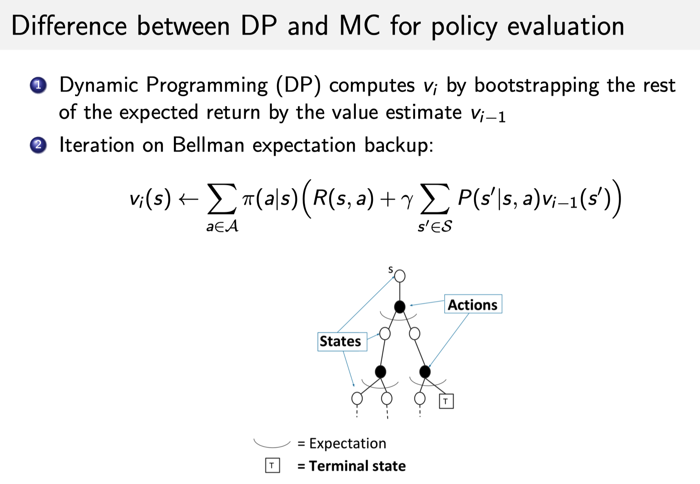

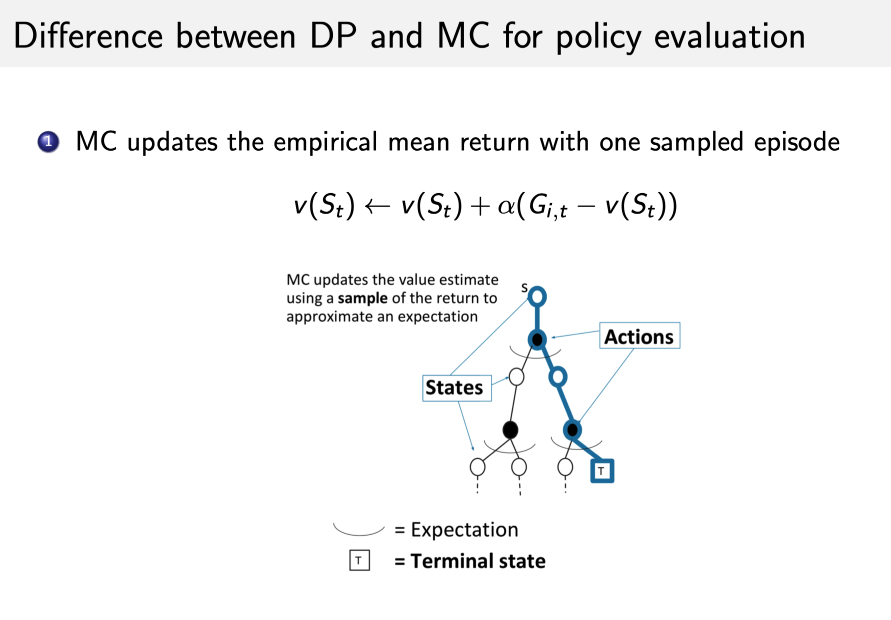

MC 是通过 empirical mean return （实际得到的收益）来更新它，对应树上面蓝色的轨迹，我们得到是一个实际的轨迹，实际的轨迹上的状态已经是决定的，采取的行为都是决定的。MC 得到的是一条轨迹，这条轨迹表现出来就是这个蓝色的从起始到最后终止状态的轨迹。现在只是更新这个轨迹上的所有状态，跟这个轨迹没有关系的状态都没有更新。

- MC 可以在不知道环境的情况下起效果，而 DP 是 model-based。
- MC 只需要更新一条轨迹的状态，而 DP 则是需要更新所有的状态。状态数量很多的时候（比如一百万个，两百万个），DP 这样去迭代的话，速度是非常慢的。这也是 MC 相对于 DP 的优势。

### Temporal Difference

- TD 是介于 MC 和 DP 之间的方法。
- TD 是 model-free 的，不需要 MDP 的转移矩阵和奖励函数。
- TD 可以从**不完整的** episode 中学习，结合了 bootstrapping 的思想。

- 上图是 TD 算法的框架。

- 目的：对于某个给定的策略，在线(online)地算出它的价值函数，即一步一步地(step-by-step)算。

- 最简单的算法是 `TD(0)`，每往前走一步，就做一步 bootstrapping，用得到的估计回报(estimated return)来更新上一时刻的值。

- 估计回报 $R_{t+1}+\gamma v(S_{t+1})$ 被称为 `TD target`，TD target 是带衰减的未来收益的总和。TD target 由两部分组成：

  - 走了某一步后得到的实际奖励：$R_{t+1}$，

  - 我们利用了 bootstrapping 的方法，通过之前的估计来估计$ v(S_{t+1})$ ，然后加了一个折扣系数，即 $\gamma v(S_{t+1})$，具体过程如下式所示：
    $$
    \begin{aligned} v(s)&=\mathbb{E}\left[G_{t} \mid s_{t}=s\right] \\ &=\mathbb{E}\left[R_{t+1}+\gamma R_{t+2}+\gamma^{2} R_{t+3}+\ldots \mid s_{t}=s\right] \\ &=\mathbb{E}\left[R_{t+1}|s_t=s\right] +\gamma \mathbb{E}\left[R_{t+2}+\gamma R_{t+3}+\gamma^{2} R_{t+4}+\ldots \mid s_{t}=s\right]\\ &=R(s)+\gamma \mathbb{E}[G_{t+1}|s_t=s] \\ &=R(s)+\gamma \mathbb{E}[v(s_{t+1})|s_t=s]\\ \end{aligned}
    $$

- `TD error` $\delta=R_{t+1}+\gamma v(S_{t+1})-v(S_t)$。

- 可以类比于 Incremental Monte-Carlo 的方法，写出如下的更新方法：
  $$
  v\left(S_{t}\right) \leftarrow v\left(S_{t}\right)+\alpha\left(R_{t+1}+\gamma v\left(S_{t+1}\right)-v\left(S_{t}\right)\right)
  $$

我们对比下 MC 和 TD：

- 在 MC 里面 $G_{i,t}$ 是实际得到的值（可以看成 target），因为它已经把一条轨迹跑完了，可以算每个状态实际的 return。
- TD 没有等轨迹结束，往前走了一步，就可以更新价值函数。

#### MC与TD的区别

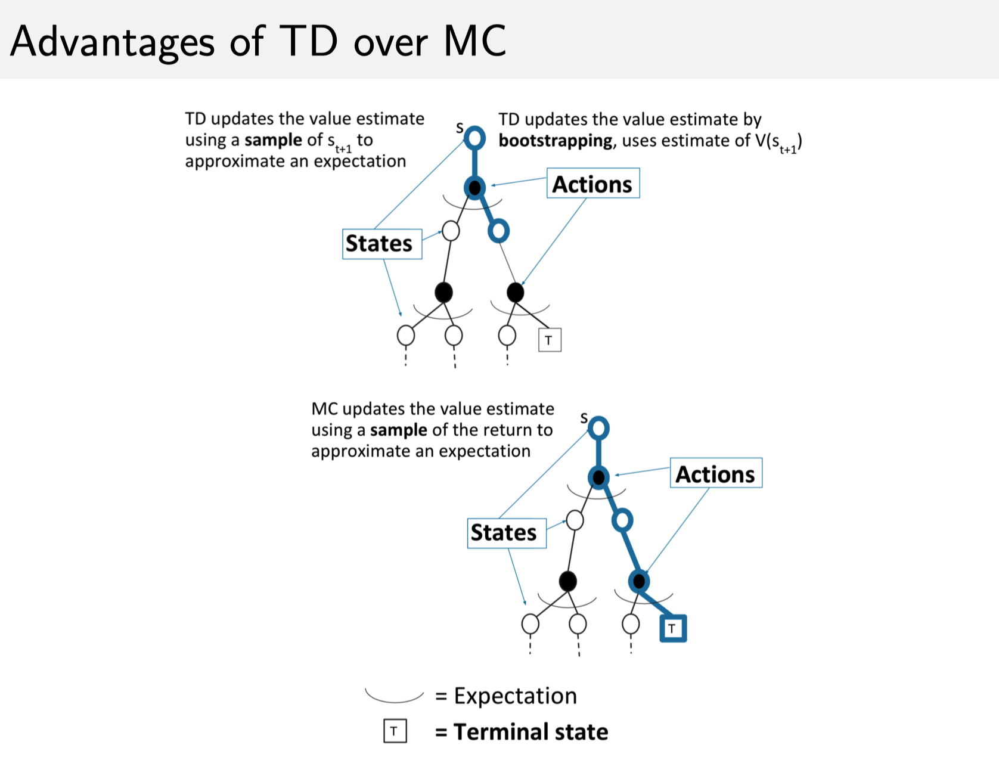

- TD 只执行了一步，状态的值就更新。
- MC 全部走完了之后，到了终止状态之后，再更新它的值。

接下来，进一步比较下 TD 和 MC。

- TD 可以在线学习(online learning)，每走一步就可以更新，效率高。
- MC 必须等游戏结束才可以学习。
- TD 可以从不完整序列上进行学习。
- MC 只能从完整的序列上进行学习。
- TD 可以在连续的环境下（没有终止）进行学习。
- MC 只能在有终止的情况下学习。
- TD 利用了马尔可夫性质，在马尔可夫环境下有更高的学习效率。
- MC 没有假设环境具有马尔可夫性质，利用采样的价值来估计某一个状态的价值，在不是马尔可夫的环境下更加有效。

n-step TD

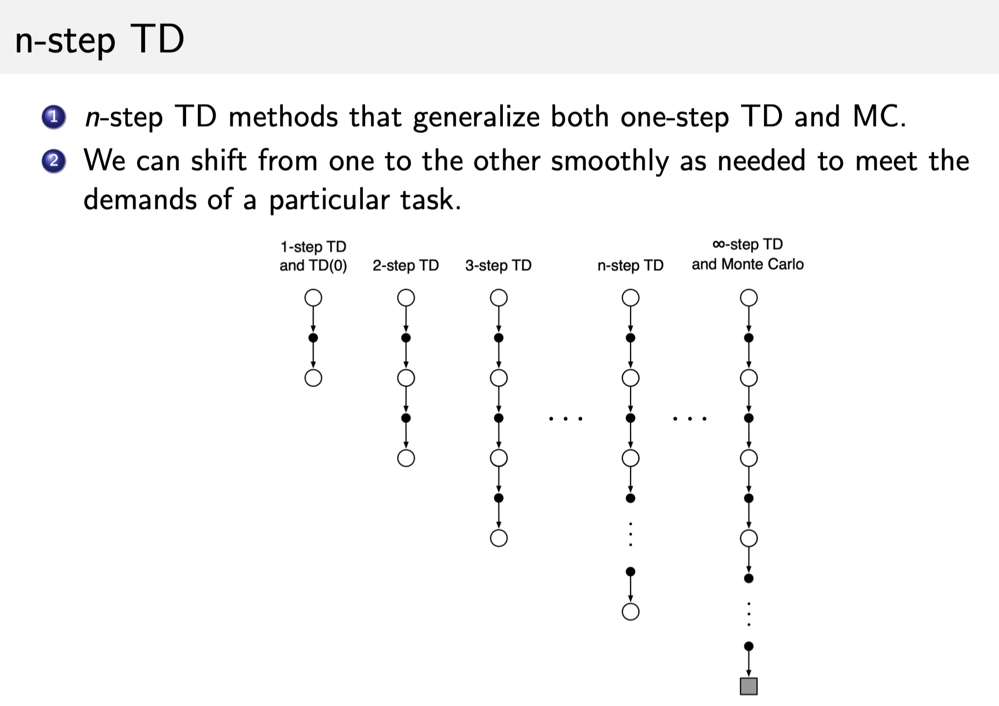

- 我们可以把 TD 进行进一步的推广。之前是只往前走一步，即 one-step TD，TD(0)。
- 我们可以调整步数，变成 `n-step TD`。比如 `TD(2)`，即往前走两步，然后利用两步得到的 return，使用 bootstrapping 来更新状态的价值。
- 这样就可以通过 step 来调整这个算法需要多少的实际奖励和 bootstrapping。

 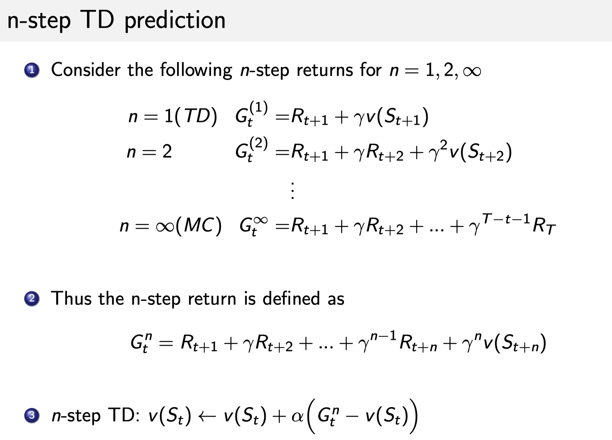

- 通过调整步数，可以进行一个 MC 和 TD 之间的 trade-off，如果 $n=\infty$， 即整个游戏结束过后，再进行更新，TD 就变成了 MC。

- n-step 的 TD target 如下式所示：
  $$
  G_{t}^{n}=R_{t+1}+\gamma R_{t+2}+\ldots+\gamma^{n-1} R_{t+n}+\gamma^{n} v\left(S_{t+n}\right)
  $$

- 得到 TD target 之后，我们用增量学习(incremental learning)的方法来更新状态的价值：
  $$
  v\left(S_{t}\right) \leftarrow v\left(S_{t}\right)+\alpha\left(G_{t}^{n}-v\left(S_{t}\right)\right)
  $$

### DP vs MC vs TD

- Bootstrapping：更新时使用了估计：
  - MC 没用 bootstrapping，因为它是根据实际的 return 来更新。
  - DP 用了 bootstrapping。
  - TD 用了 bootstrapping。
- Sampling：更新时通过采样得到一个期望：
  - MC 是纯 sampling 的方法。
  - DP 没有用 sampling，它是直接用 Bellman expectation equation 来更新状态价值的。
  - TD 用了 sampling。TD target 由两部分组成，一部分是 sampling，一部分是 bootstrapping。

DP 是直接算 expectation，把它所有相关的状态都进行加和。

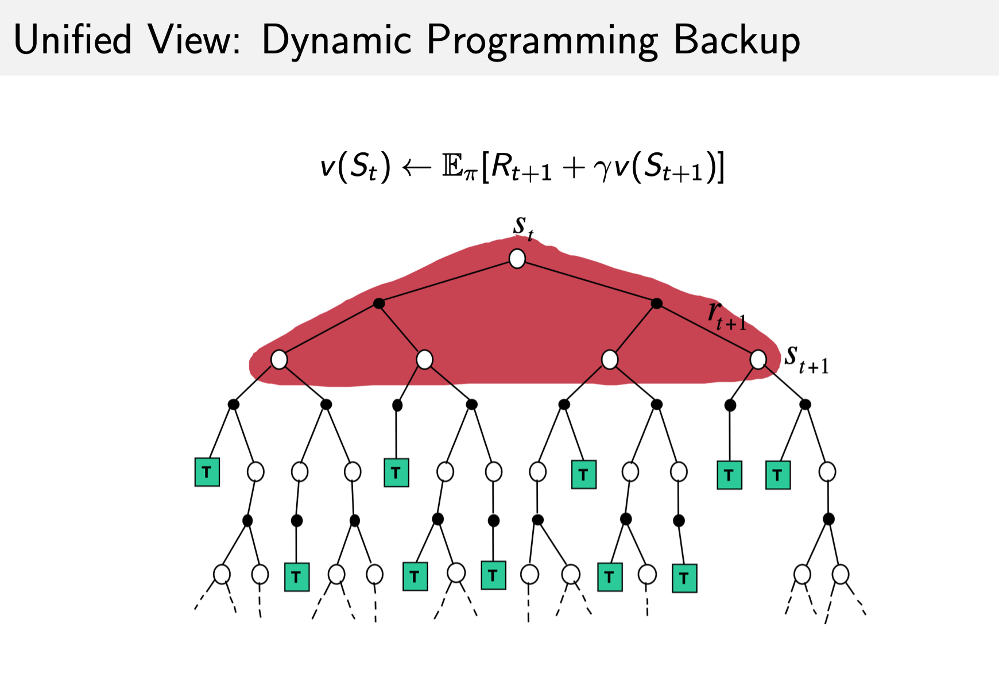

MC 在当前状态下，采一个支路，在一个path 上进行更新，更新这个 path 上的所有状态。

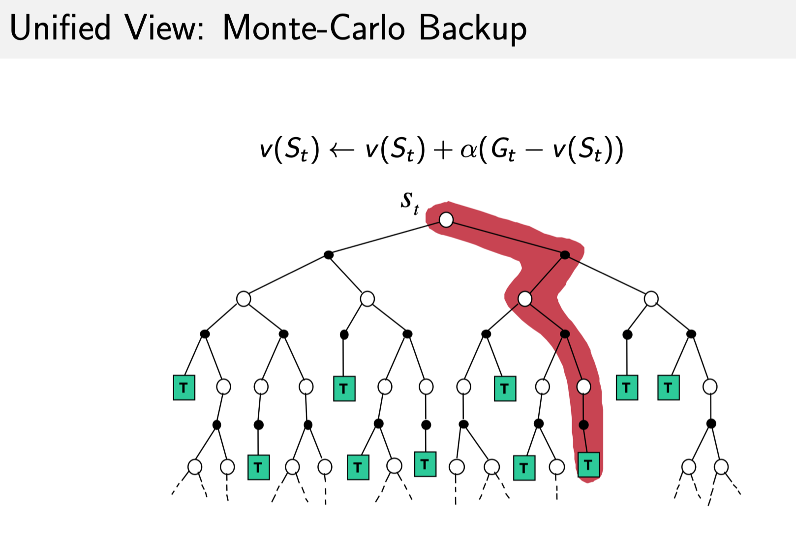

TD 是从当前状态开始，往前走了一步，关注的是非常局部的步骤。

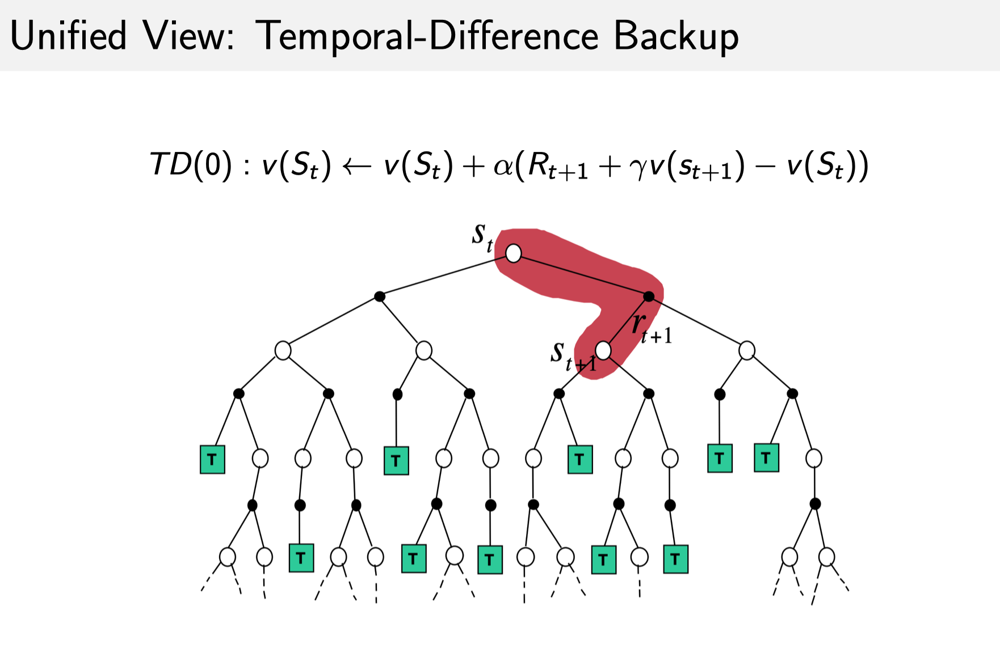

- 如果 TD 需要更广度的 update，就变成了 DP（因为 DP 是把所有状态都考虑进去来进行更新）。
- 如果 TD 需要更深度的 update，就变成了 MC。
- 右下角是穷举的方法（exhaustive search），穷举的方法既需要很深度的信息，又需要很广度的信息。

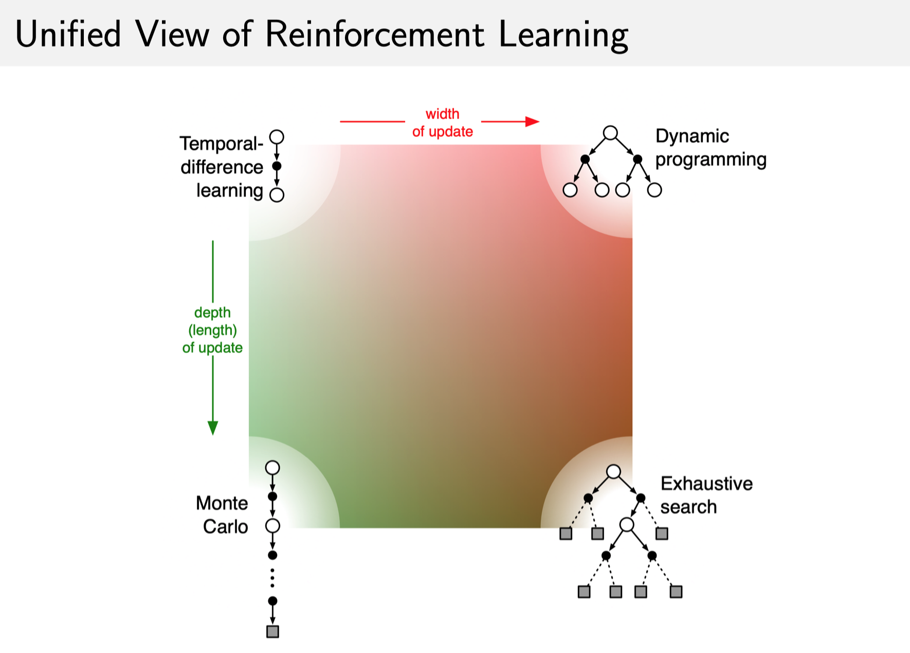

## Model-free Control

就是当我们不知道 MDP 模型情况下，如何优化价值函数，得到最佳的策略？

我们可以把 policy iteration 进行一个广义的推广，使它能够兼容 MC 和 TD 的方法，即 `Generalized Policy Iteration(GPI) with MC and TD`。

Policy iteration 由两个步骤组成：

1. 根据给定的当前的 policy $ \pi$ 来估计价值函数；
2. 得到估计的价值函数后，通过 greedy 的方法来改进它的算法。

这两个步骤是一个互相迭代的过程。

但是当得到一个价值函数过后，我们并不知道它的奖励函数和状态转移，所以就没法估计它的 Q 函数。所以这里有一个问题：当我们不知道奖励函数和状态转移时，如何进行策略的优化。

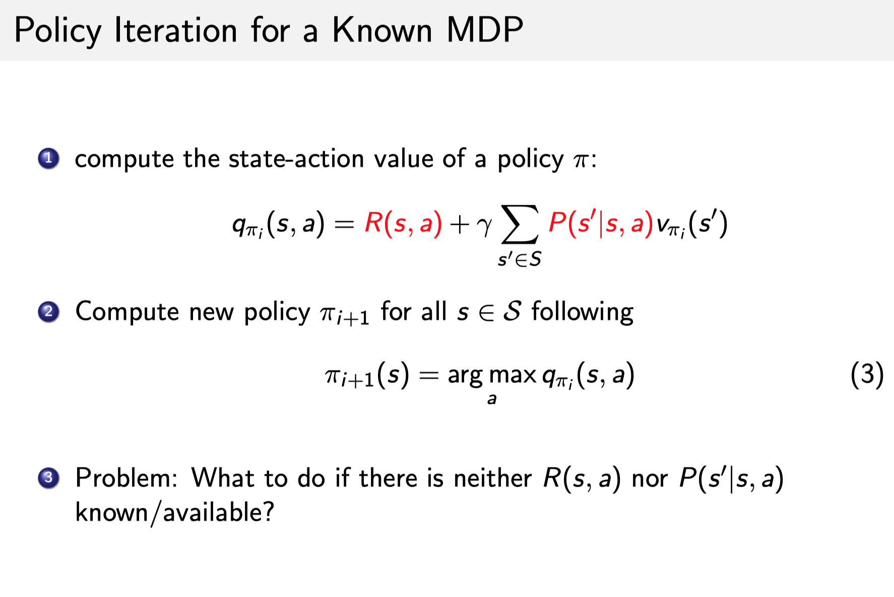

针对上述情况，我们引入了广义的 policy iteration 的方法。

我们对 policy evaluation 部分进行修改：因为Q函数只与状态和行动相关，所以用 MC 的方法代替 DP 的方法去估计 Q 函数。

当得到 Q 函数后，就可以通过 greedy 的方法去改进它。

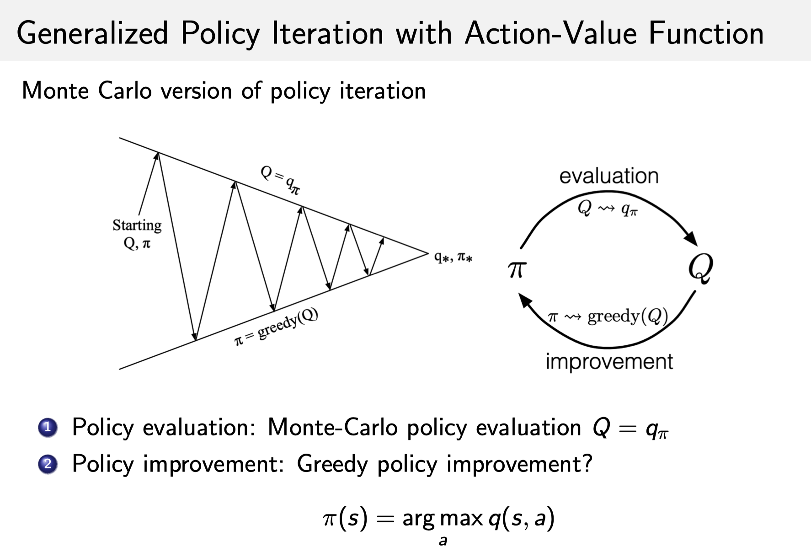

### Exploring Starts

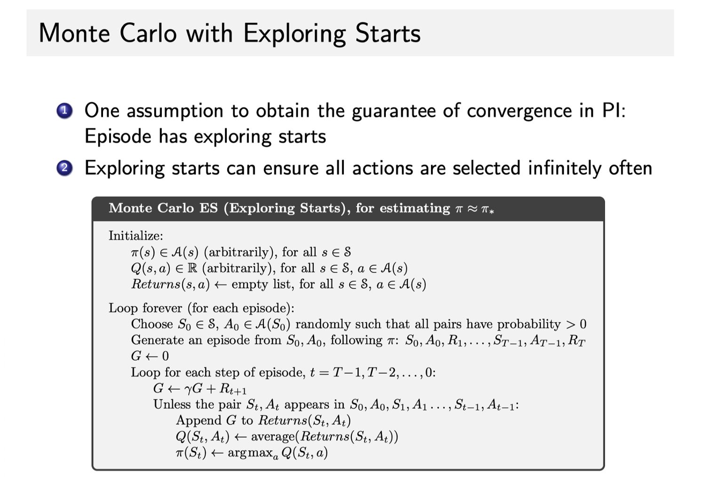

上图是用 MC 估计 Q 函数的算法。

- 假设每一个 episode 都有一个 `exploring start`，exploring start 保证所有的状态和动作能被采样到的概率大于0，这样才能很好地去估计。
- 算法通过 MC 的方法产生了很多的轨迹，每个轨迹都可以算出它的价值。然后，我们可以通过 average 的方法去估计 Q 函数。Q 函数可以看成一个 Q-table，通过采样的方法把表格的每个单元的值都填上，然后我们使用 policy improvement 来选取更好的策略。
- 算法核心：如何用 MC 方法来填 Q-table。

为了确保 MC 方法能够有足够的探索，我们使用了 $\varepsilon-greedy$ exploration。

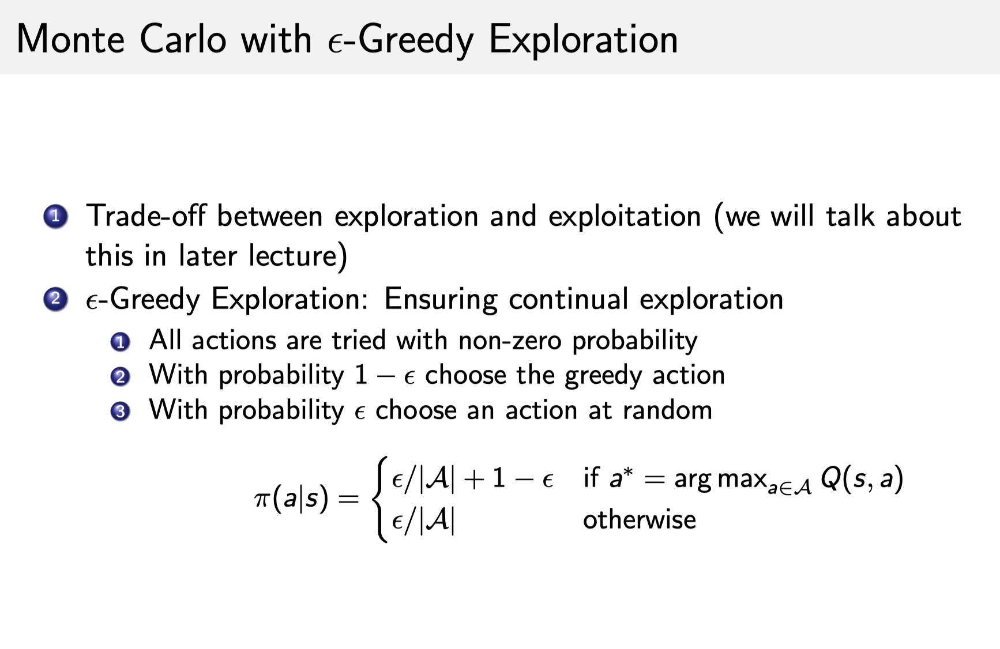

ε-greedy 的意思是说，我们有 $1-\varepsilon$ 的概率会按照 Q-function 来决定 action，通常 $\varepsilon$ 就设一个较大的值， 保证exploration的充足。通常$ \varepsilon$ 会随着时间递减。在最开始的时候。因为还不知道那个 action 是比较好的，所以你会花比较大的力气在做 exploration。接下来随着训练的次数越来越多。已经比较确定说哪一个 Q 是比较好的。你就会减少你的 exploration，你会把$ \varepsilon$ 的值变小，主要根据 Q-function 来决定你的 action，较少概率做随机决策，这是$ \varepsilon\text{-greedy}$。

$ \varepsilon\text{-greedy}$ 的有效性：

当我们使用 MC 和 \varepsilonε-greedy 探索这个形式的时候，我们可以确保价值函数是单调的，改进的。

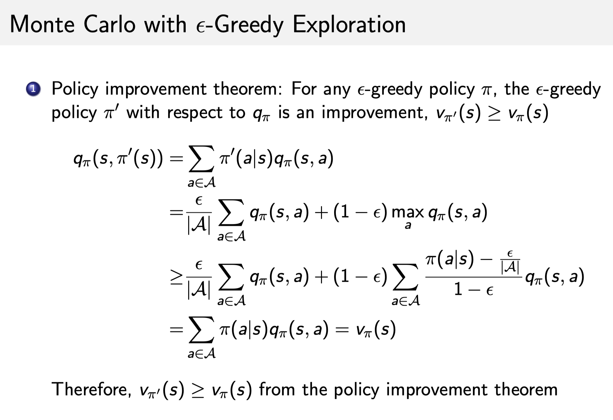

算法表示：

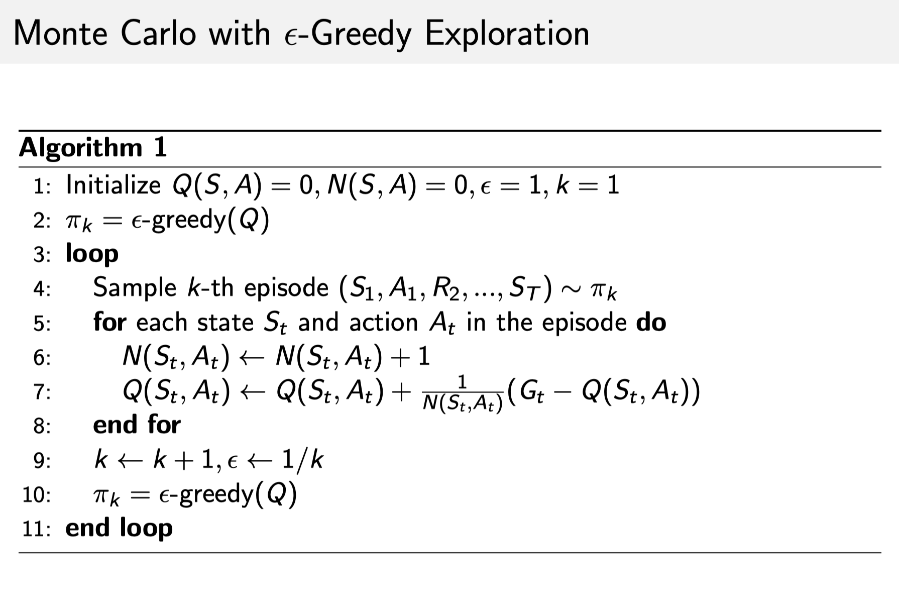

自然而然我们可以把TD的方法融入其中去估计 Q-table，再采取这个$ \varepsilon$-greedy。这样就可以在 episode 没结束的时候来更新已经采集到的状态价值。

与 MC 相比，TD 有如下几个优势：

- 低方差。
- 能够在线学习。
- 能够从不完整的序列学习。

### Sarsa (TD in Model-free)

前面是MC算法在无模型场景的形式，其实就是更新Q函数，那么Sarsa其实就是TD算法在无模型场景的形式：

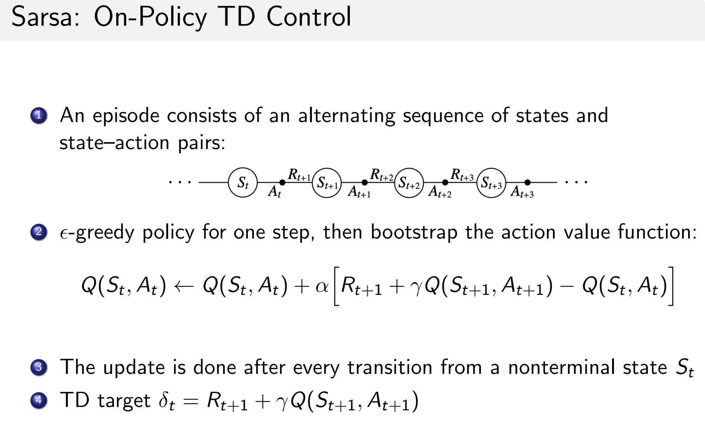

on-policy：使用同一个policy，既使用它去采集数据，同时也使用它去优化自身。

Sarsa 所作出的改变很简单，就是将原本我们 TD 更新 V 的过程，变成了更新 Q，如下式所示：
$$
Q\left(S_{t}, A_{t}\right) \leftarrow Q\left(S_{t}, A_{t}\right)+\alpha\left[R_{t+1}+\gamma Q\left(S_{t+1}, A_{t+1}\right)-Q\left(S_{t}, A_{t}\right)\right]
$$
这个公式就是说可以拿下一步的 Q 值 $Q(S_{t+_1},A_{t+1})$ 来更新我这一步的 Q 值 $Q(S_t,A_t)$ 。

Sarsa 是直接估计 Q-table，得到 Q-table 后，就可以更新策略。

**该算法由于每次更新值函数需要知道当前的状态(state)、当前的动作(action)、奖励(reward)、下一步的状态(state)、下一步的动作(action)，即 $(S_{t}, A_{t}, R_{t+1}, S_{t+1}, A_{t+1})$这几个值 ，由此得名 `Sarsa` 算法**。它走了一步之后，拿到了 $(S_{t}, A_{t}, R_{t+1}, S_{t+1}, A_{t+1})$之后，就可以做一次更新。

上面其实是TD(0)。

#### n-step Sarsa

Sarsa 属于单步更新法，也就是说每执行一个动作，就会更新一次价值和策略。如果不进行单步更新，而是采取 n 步更新，即在执行 n 步之后再来更新价值和策略，这样就得到了 `n 步 Sarsa(n-step Sarsa)`。

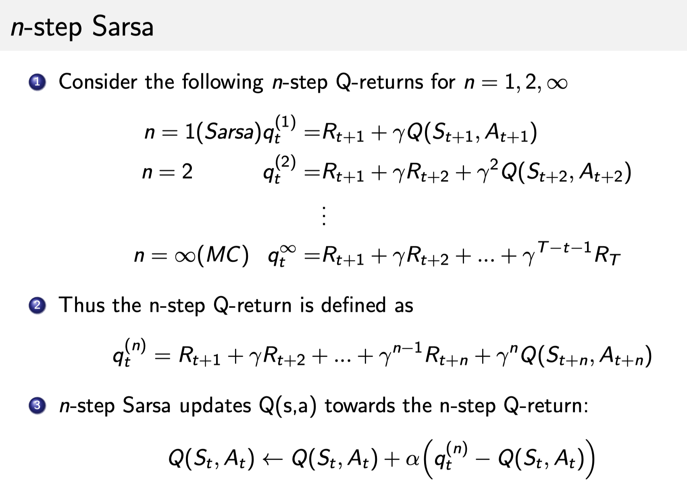

### On-policy vs Off-policy

on-policy: 只有一个策略，既利用这个策略进行数据采集（ action 的选取），也利用这个策略进行自身策略优化，来学到最佳策略。

而 off-policy 在学习的过程中，有两种不同的策略:

* 第一个策略 $\pi$是我们需要去学习的策略，即`target policy(目标策略)` $\pi$
* 另外一个策略$\mu$是探索环境的策略，即`behavior policy(行为策略)` $\mu$

我们需要去学习策略$\pi$，但是我们进行数据采集（ action 的选取）是通过策略$\mu$来完成的。在 off-policy learning 的过程中，我们这些轨迹都是 behavior policy  $\mu$跟环境交互产生的，产生这些轨迹后，我们使用这些轨迹来更新 target policy $\pi$。

**Off-policy learning 有很多好处：**

- 我们可以利用 exploratory policy 来学到一个最佳的策略，学习效率高；
- 可以让我们学习其他 agent 的行为，模仿学习，学习人或者其他 agent 产生的轨迹；
- 重用老的策略产生的轨迹。探索过程需要很多计算资源，这样的话，可以节省资源。

### Off-policy Q-learning 

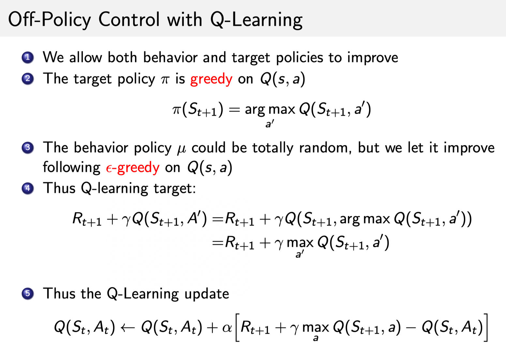

Q-learning 有两种 policy：behavior policy ($\varepsilon\text{-greedy}$) 和 target policy (greedy)。一开始这两种策略会相差较大（$\varepsilon$一开始较大），后续逐渐收敛。

Target policy $\pi$ 直接在 Q-table 上取 greedy，就取它下一步能得到的所有状态，如下式所示：
$$
\pi\left(S_{t+1}\right)=\underset{a^{\prime}}{\arg \max}~ Q\left(S_{t+1}, a^{\prime}\right)
$$
Behavior policy $\mu$ 可以是一个随机的 policy，但我们采取 $\varepsilon\text{-greedy}$，让 behavior policy 不至于是完全随机的，它是基于 Q-table 逐渐改进的。

我们可以构造 Q-learning target，Q-learning 的 next action 都是通过 arg max 操作来选出来的，于是我们可以代入 arg max 操作，可以得到下式：
$$
\begin{aligned} R_{t+1}+\gamma Q\left(S_{t+1}, A^{\prime}\right) &=R_{t+1}+\gamma Q\left(S_{t+1},\arg \max ~Q\left(S_{t+1}, a^{\prime}\right)\right) \\ &=R_{t+1}+\gamma \max _{a^{\prime}} Q\left(S_{t+1}, a^{\prime}\right) \end{aligned}
$$
接着我们可以把 Q-learning 更新写成增量学习的形式，TD target 就变成 max 的值，即
$$
Q\left(S_{t}, A_{t}\right) \leftarrow Q\left(S_{t}, A_{t}\right)+\alpha\left[R_{t+1}+\gamma \max _{a} Q\left(S_{t+1}, a\right)-Q\left(S_{t}, A_{t}\right)\right]
$$
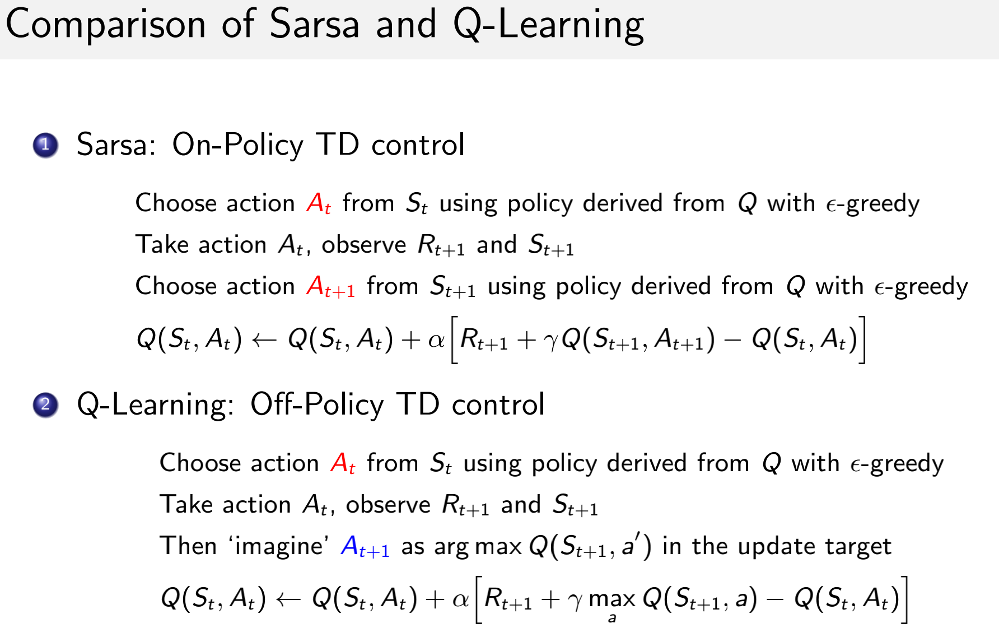

**Q-learning 是 off-policy 的时序差分(TD)学习方法，Sarsa 是 on-policy 的时序差分(TD)学习方法。**

- Sarsa： $A_{t+1}，A_t$都是来自于同一个策略采样。在更新 Q 表格的时候，它用到的 $A_{t+1}$为下一个状态实际的动作。这个 action 有可能是 $\varepsilon -greedy$ 方法采样出来的值，也有可能是 max Q 对应的 action，所以它有可能是随机动作，但这是它实际执行的那个动作。
- 但是 Q-learning 在更新 Q 表格的时候，它用到这个的 Q 值 $Q(S',a)$对应的那个 action ，它不一定是下一个 step 会执行的实际的 action，因为你下一个实际会执行的那个 action 可能是随机动作。
- Q-learning 的 next action $A_{t+1}$是imagine出来的，Q-learning 直接看 Q-table，取它的 max 的这个值，它是默认 A' 为最优策略选的动作，所以 Q-learning 在学习的时候，不需要传入 A'，即 $A_{t+1}$的值。

**Sarsa 和 Q-learning 的更新公式都是一样的，区别只在 target 计算的这一部分，**

- Sarsa 是 $R_{t+1}+\gamma Q(S_{t+1}, A_{t+1})$；
- Q-learning 是 $R_{t+1}+\gamma \underset{a}{\max} Q\left(S_{t+1}, a\right)$。

Sarsa 是用自己的策略产生了 S,A,R,S',A' 这一条轨迹。然后拿着 $Q(S_{t+1},A_{t+1})$ 去更新原本的 Q 值 $Q(S_t,A_t)$。

但是 Q-learning 并不需要知道我实际上选择哪一个 action ，它默认下一个动作就是 Q 最大的那个动作。Q-learning 知道实际上 behavior policy 可能会有 10% 的概率去选择别的动作，但 Q-learning 并不担心受到探索的影响，它默认了就按照最优的策略来去优化目标策略，所以它可以更大胆地去寻找最优的路径，它会表现得比 Sarsa 大胆非常多。

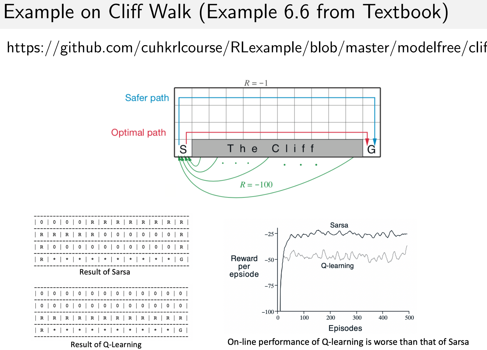

