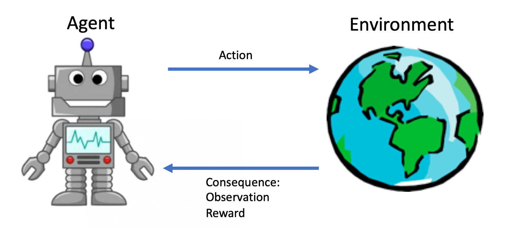
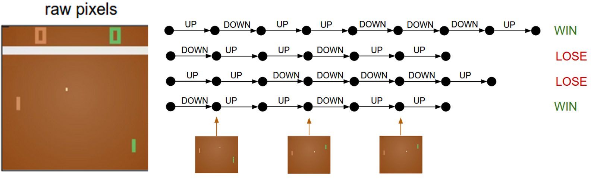
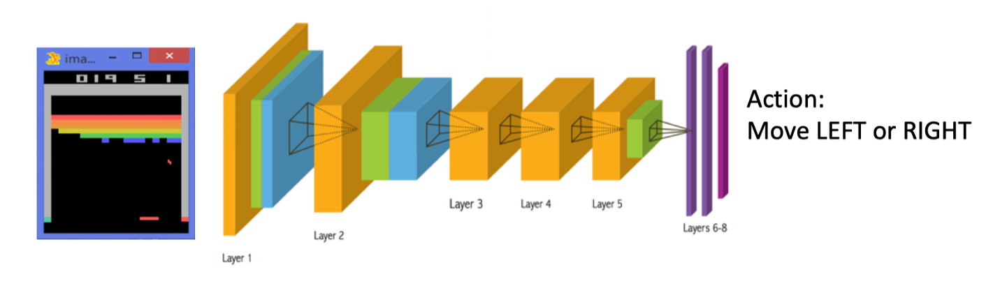
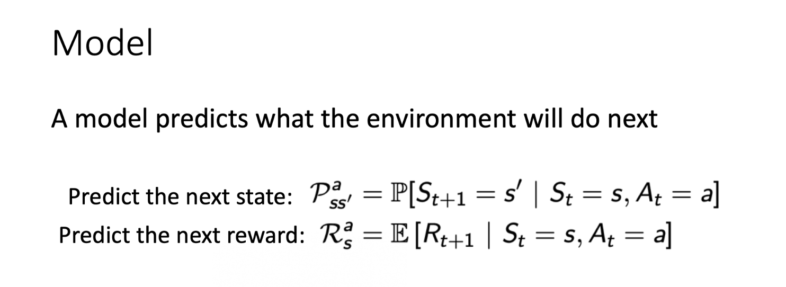
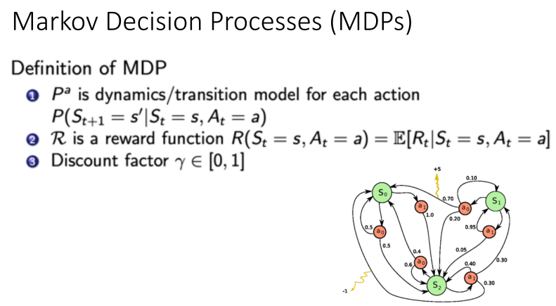
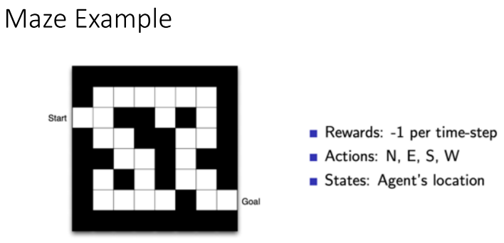
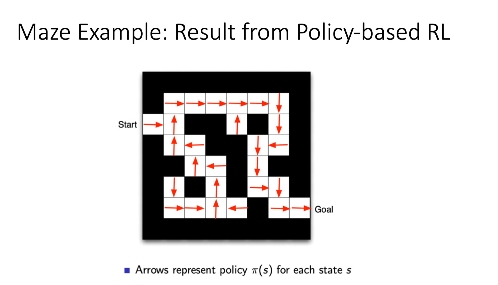
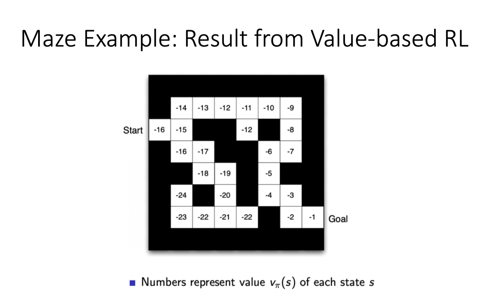
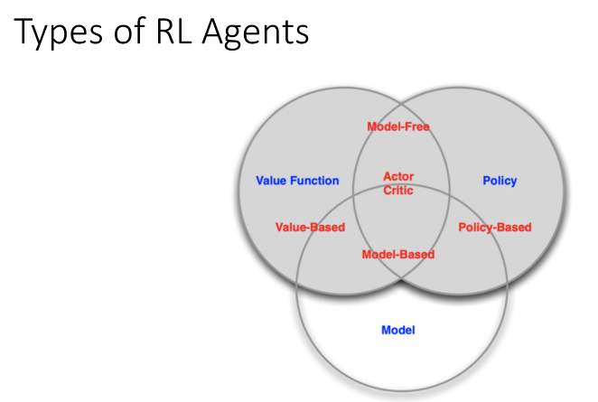
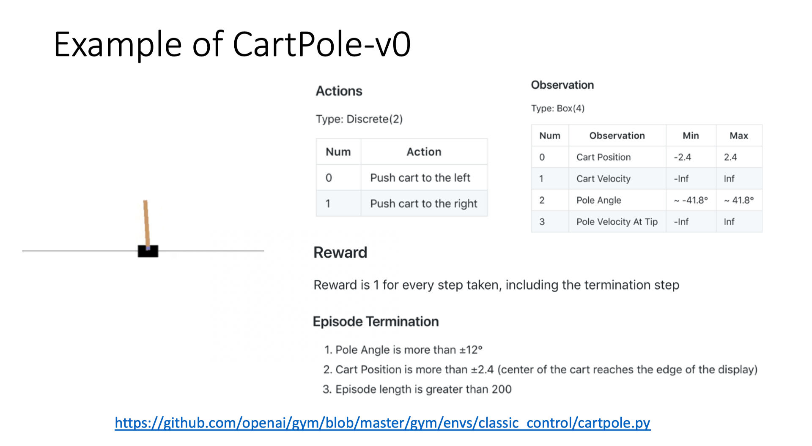

# RL序列决策过程

强化学习研究的问题是 agent 跟环境交互，上图左边画的是一个 agent，agent 一直在跟环境进行交互。这个 agent 把它输出的动作给环境，环境取得这个动作过后，会进行到下一步，然后会把下一步的观测跟它上一步是否得到奖励返还给 agent。

通过这样的交互过程会产生很多观测，agent 的目的是从这些观测之中学到能极大化奖励的策略。

## 奖励 Reward

奖励是由环境给的一个标量的反馈信号(scalar feedback signal)，这个信号显示了 agent 在某一步采取了某个策略的表现如何。

强化学习的目的就是为了最大化 agent 可以获得的奖励，agent 在这个环境里面存在的目的就是为了极大化它的期望的累积奖励(expected cumulative reward)。

不同的环境，奖励也是不同的。这里给大家举一些奖励的例子。

- 比如说一个下象棋的选手，他的目的其实就为了赢棋。奖励是说在最后棋局结束的时候，他知道会得到一个正奖励或者负奖励。
- 羚羊站立也是一个强化学习过程，它得到的奖励就是它是否可以最后跟它妈妈一块离开或者它被吃掉。
- 在股票管理里面，奖励定义由你的股票获取的收益跟损失决定。
- 在玩雅达利游戏的时候，奖励就是你有没有在增加游戏的分数，奖励本身的稀疏程度决定了这个游戏的难度。

在一个强化学习环境里面，agent 的目的就是选取一系列的动作来极大化它的奖励，所以这些采取的动作必须有长期的影响。但在这个过程里面，它的奖励其实是被延迟了，就是说你现在采取的某一步决策可能要等到时间很久过后才知道这一步到底产生了什么样的影响。

这里一个示意图就是我们玩这个 Atari 的 Pong 游戏，你可能只有到最后游戏结束过后，才知道这个球到底有没有击打过去。中间你采取的 up 或 down 行为，并不会直接产生奖励。强化学习里面一个重要的课题就是近期奖励和远期奖励的一个权衡(trade-off)。怎么让 agent 取得更多的长期奖励是强化学习重要的问题。

在跟环境的交互过程中，agent 会获得很多观测。在每一个观测会采取一个动作，它也会得到一个奖励。**所以历史是观测(observation)、行为、奖励的序列：**
$$
H_{t}=O_{1}, R_{1}, A_{1}, \ldots, A_{t-1}, O_{t}, R_{t}
$$
Agent 在采取当前动作的时候会依赖于它之前得到的这个历史，**所以你可以把整个游戏的状态看成关于这个历史的函数：**
$$
S_{t}=f\left(H_{t}\right)
$$

## 状态和观测的关系

`状态(state)` **s** 是对世界的完整描述，不会隐藏世界的信息。`观测(observation)` **o** 是对状态的部分描述，可能会遗漏一些信息。在 deep RL 中，我们几乎总是用一个实值的向量、矩阵或者更高阶的张量来表示状态和观测。举个例子，我们可以用 RGB 像素值的矩阵来表示一个视觉的观测，我们可以用机器人关节的角度和速度来表示一个机器人的状态。

环境有自己的函数 $S_{t}^{e}=f^{e}\left(H_{t}\right)$来更新状态，在 agent 的内部也有一个函数 $S_{t}^{a}=f^{a}\left(H_{t}\right)$ 来更新状态。当 agent 的状态跟环境的状态等价的时候，我们就说这个环境是 `full observability`，就是全部可以观测。换句话说，当 agent 能够观察到环境的所有状态时，我们称这个环境是`完全可观测的(fully observed)`。在这种情况下面，强化学习通常被建模成一个 Markov decision process(MDP)的问题。在 MDP 中， $O_{t}=S_{t}^{e}=S_{t}^{a}$。

但是有一种情况是 agent 得到的观测并不能包含环境运作的所有状态，因为在这个强化学习的设定里面，环境的状态才是真正的所有状态。

- 比如 agent 在玩这个 black jack 这个游戏，它能看到的其实是牌面上的牌。
- 或者在玩雅达利游戏的时候，观测到的只是当前电视上面这一帧的信息，你并没有得到游戏内部里面所有的运作状态。

也就是说当 agent 只能看到部分的观测，我们就称这个环境是`部分可观测的(partially observed)`。在这种情况下面，强化学习通常被建模成一个 POMDP 的问题。

`部分可观测马尔可夫决策过程(Partially Observable Markov Decision Processes, POMDP)`是一个马尔可夫决策过程的泛化。POMDP 依然具有马尔可夫性质，但是假设智能体无法感知环境的状态 **s**，只能知道部分观测值 **o**。比如在自动驾驶中，智能体只能感知传感器采集的有限的环境信息。

POMDP 可以用一个 7 元组描述：$(S,A,T,R,\Omega,O,\gamma)$，其中 SS 表示状态空间，为隐变量，AA 为动作空间，$T(s'|s,a)$ 为状态转移概率，RR 为奖励函数，$\Omega(o|s,a)$ 为观测概率，**O** 为观测空间，$\gamma$ 为折扣系数。

## RL Agent的主要组成成分

对于一个强化学习 agent，它可能有一个或多个如下的组成成分：

- 首先 agent 有一个 `策略函数(policy function)`，agent 会用这个函数来选取下一步的动作。
- 然后它也可能生成一个`价值函数(value function)`。我们用价值函数来对当前状态进行估价，它就是说你进入现在这个状态，可以对你后面的收益带来多大的影响。当这个价值函数大的时候，说明你进入这个状态越有利。
- 另外一个组成成分是`模型(model)`。模型表示了 agent 对这个环境的状态进行了理解，它决定了这个世界是如何进行的。

我们深入看这三个组成成分的一些细节。

### Policy

Policy 是 agent 的行为模型，它决定了这个 agent 的行为，它其实是一个函数，把输入的状态变成行为。这里有两种 policy：

- 一种是 `stochastic policy(随机性策略)`，它就是 $\pi$ 函数 $\pi(a | s)=P\left[A_{t}=a | S_{t}=s\right]$ 。当你输入一个状态 **s** 的时候，输出是一个概率。这个概率就是你所有行为的一个概率，然后你可以进一步对这个概率分布进行采样，得到真实的你采取的行为。比如说这个概率可能是有$ 70\%$ 的概率往左，30% 的概率往右，那么你通过采样就可以得到一个 action。
- 一种是 `deterministic policy(确定性策略)`，就是说你这里有可能只是采取它的极大化，采取最有可能的动作，即 $a^{*}=\arg \underset{a}{\max} \pi(a \mid s)$。 你现在这个概率就是事先决定好的。

从 Atari 游戏来看的话，策略函数的输入就是游戏的一帧，它的输出决定你是往左走还是往右走。

通常情况下，强化学习一般使用`随机性策略`。随机性策略有很多优点：

- 在学习时可以通过引入一定随机性来更好地探索环境；
- 随机性策略的动作具有多样性，这一点在多个智能体博弈时也非常重要。采用确定性策略的智能体总是对同样的环境做出相同的动作，会导致它的策略很容易被对手预测。

### Value Function

**价值函数是未来奖励的一个预测，用来评估状态的好坏**。

价值函数里面有一个 `discount factor(折扣因子)`，我们希望尽可能在短的时间里面得到尽可能多的奖励。如果我们说十天过后，我给你 100 块钱，跟我现在给你 100 块钱，你肯定更希望我现在就给你 100 块钱，因为你可以把这 100 块钱存在银行里面，你就会有一些利息。所以我们就通过把这个折扣因子放到价值函数的定义里面，价值函数的定义其实是一个期望，如下式所示：
$$
v_{\pi}(s) \doteq \mathbb{E}_{\pi}\left[G_{t} \mid S_{t}=s\right]=\mathbb{E}_{\pi}\left[\sum_{k=0}^{\infty} \gamma^{k} R_{t+k+1} \mid S_{t}=s\right], \text { for all } s \in \mathcal{S}
$$
这里有一个期望 $\mathbb{E}_{\pi}$，这里有个小角标是 $\pi$函数，这个 $\pi$函数就是说在我们已知某一个策略函数的时候，到底可以得到多少的奖励。所以价值函数就是对于未来的奖励进行折合的加减。

我们还有一种价值函数：Q 函数。Q 函数里面包含两个变量：状态和动作，其定义如下式所示：
$$
q_{\pi}(s, a) \doteq \mathbb{E}_{\pi}\left[G_{t} \mid S_{t}=s, A_{t}=a\right]=\mathbb{E}_{\pi}\left[\sum_{k=0}^{\infty} \gamma^{k} R_{t+k+1} \mid S_{t}=s, A_{t}=a\right]
$$
所以你未来可以获得多少的奖励，它的这个期望取决于你当前的状态和当前的行为。这个 Q 函数是强化学习算法里面要学习的一个函数。因为当我们得到这个 Q 函数后，进入某一种状态，它最优的行为就可以通过这个 Q 函数来得到。

### Model

第三个组成部分是模型，**模型决定了下一个状态会是什么样的，就是说下一步的状态取决于你当前的状态以及你当前采取的行为。**它由两个部分组成，

- 概率：这个转移状态之间是怎么转移的。
- 奖励函数：当你在当前状态采取了某一个行为，可以得到多大的奖励。

当我们有了这三个组成部分过后，就形成了一个 `马尔可夫决策过程(Markov Decision Process)`。这个决策过程可视化了状态之间的转移以及采取的行为。

## Maze Example

我们来看一个走迷宫的例子。

- 这个例子要求 agent 从 start 开始，然后到达 goal 的位置。
- 这里设定的奖励是每走一步，你就会得到一个-1的奖励。
- 这里可以采取的动作是往上下左右走。
- 当前状态用现在 agent 所在的位置来描述。

- 我们可以用不同的强化学习算法来解这个环境。
- 如果采取的是 `基于策略的(policy-based)RL`，当学习好了这个环境过后，在每一个状态，我们就会得到一个最佳的行为。
- 比如说现在在第一格开始的时候，我们知道它最佳行为是往右走，然后第二格的时候，得到的最佳策略是往上走，第三格是往右走。通过这个最佳的策略，我们就可以最快地到达终点。

- 如果换成 `基于价值的(value-based)RL` 这个算法，利用价值函数来作为导向，我们就会得到另外一种表征，这里就表征了你每一个状态会返回一个价值。
- 比如说你在 start 位置的时候，价值是 -16，因为你最快可以 16 步到达终点。因为每走一步会减一，所以你这里的价值是 -16。
- 当我们快接近最后终点的时候，这个数字变得越来越大。在拐角的时候，比如要现在在第二格 -15。然后 agent 会看上下，它看到上面值变大了，变成 -14 了，它下面是 -16，那么 agent 肯定就会采取一个往上走的策略。所以通过这个学习的值的不同，我们可以抽取出现在最佳的策略。

## RL Agent的类型

**根据 agent 学习的东西不同，我们可以把 agent 进行归类。**

- 基于价值的 agent(value-based agent)。
  - 这一类 agent 显式地学习的是价值函数，
  - 隐式地学习了它的策略。策略是从我们学到的价值函数里面推算出来的。
- 基于策略的 agent(policy-based agent)。
  - 这一类 agent 直接去学习 policy，就是说你直接给它一个状态，它就会输出这个动作的概率。
  - 在基于策略的 agent 里面并没有去学习它的价值函数。
- 把 value-based 和 policy-based 结合起来就有了 `Actor-Critic agent`。这一类 agent 把它的策略函数和价值函数都学习了，然后通过两者的交互得到一个最佳的行为。

#### 基于策略迭代和基于价值迭代的强化学习方法的区别

对于一个状态转移概率已知的马尔可夫决策过程，我们可以使用动态规划算法来求解；从决策方式来看，强化学习又可以划分为基于策略迭代的方法和基于价值迭代的方法。`决策方式`是智能体在给定状态下从动作集合中选择一个动作的依据，它是静态的，不随状态变化而变化。

在`基于策略迭代`的强化学习方法中，智能体会`制定一套动作策略`（确定在给定状态下需要采取何种动作），并根据这个策略进行操作。强化学习算法直接对策略进行优化，使制定的策略能够获得最大的奖励。

而在`基于价值迭代`的强化学习方法中，智能体不需要制定显式的策略，它`维护一个价值表格或价值函数`，并通过这个价值表格或价值函数来选取价值最大的动作。基于价值迭代的方法只能应用在不连续的、离散的环境下（如围棋或某些游戏领域），对于行为集合规模庞大、动作连续的场景（如机器人控制领域），其很难学习到较好的结果（此时基于策略迭代的方法能够根据设定的策略来选择连续的动作)。

基于价值迭代的强化学习算法有 Q-learning、 Sarsa 等，而基于策略迭代的强化学习算法有策略梯度算法等。此外， Actor-Critic 算法同时使用策略和价值评估来做出决策，其中，智能体会根据策略做出动作，而价值函数会对做出的动作给出价值，这样可以在原有的策略梯度算法的基础上加速学习过程，取得更好的效果。

**还可以通过 agent 到底有没有学习这个环境模型来分类。**

- 第一种是 `model-based(有模型)` RL agent，它通过学习这个状态的转移来采取动作。
- 另外一种是 ` model-free(免模型)` RL agent，它没有去直接估计这个状态的转移，也没有得到环境的具体转移变量。它通过学习价值函数和策略函数进行决策。Model-free 的模型里面没有一个环境转移的模型。

然而在实际应用中，智能体并不是那么容易就能知晓 MDP 中的所有元素的。**通常情况下，状态转移函数和奖励函数很难估计，甚至连环境中的状态都可能是未知的，这时就需要采用免模型学习。**免模型学习没有对真实环境进行建模，智能体只能在真实环境中通过一定的策略来执行动作，等待奖励和状态迁移，然后根据这些反馈信息来更新行为策略，这样反复迭代直到学习到最优策略。

#### 有模型强化学习和免模型强化学习的区别

- 有模型学习是指根据环境中的经验，构建一个虚拟世界，同时在真实环境和虚拟世界中学习；
- 免模型学习是指不对环境进行建模，直接与真实环境进行交互来学习到最优策略。

免模型学习的泛化性要优于有模型学习，原因是有模型学习算需要对真实环境进行建模，并且虚拟世界与真实环境之间可能还有差异，这限制了有模型学习算法的泛化性。

## Exploration and Exploitation

在强化学习里面，`探索(Exploration)` 和`利用(Exploitation)` 是两个很核心的问题。

- 探索是说我们怎么去探索这个环境，通过尝试不同的行为来得到一个最佳的策略，得到最大奖励的策略。
- 利用是说我们不去尝试新的东西，就采取已知的可以得到很大奖励的行为。

因为在刚开始的时候强化学习 agent 不知道它采取了某个行为会发生什么，所以它只能通过试错去探索。所以探索就是在试错来理解采取的这个行为到底可不可以得到好的奖励。利用是说我们直接采取已知的可以得到很好奖励的行为。所以这里就面临一个权衡，怎么通过牺牲一些短期的奖励来获得行为的理解，从而学习到更好的策略。

下面举一些探索和利用的例子。

- 以选择餐馆为例，
  - 利用：我们直接去你最喜欢的餐馆，因为你去过这个餐馆很多次了，所以你知道这里面的菜都非常可口。
  - 探索：你把手机拿出来，你直接搜索一个新的餐馆，然后去尝试它到底好不好吃。你有可能对这个新的餐馆非常不满意，钱就浪费了。

## Example

这里我们看一下 CartPole 的这个环境。对于这个环境，有两个动作，Cart 往左移还是往右移。这里得到了观测：

- 这个车当前的位置，
- Cart 当前往左往右移的速度，
- 这个杆的角度以及杆的最高点的速度。

如果 observation 越详细，就可以更好地描述当前这个所有的状态。这里有 reward 的定义，如果能多保留一步，你就会得到一个奖励，所以你需要在尽可能多的时间存活来得到更多的奖励。当这个杆的角度大于某一个角度（没能保持平衡）或者这个车已经出到外面的时候，游戏就结束了，你就输了。所以这个 agent 的目的就是为了控制木棍，让它尽可能地保持平衡以及尽可能保持在这个环境的中央。