# Reinforcement Learning I

## 什么是强化学习？

一个agent怎么在不确定的环境(environment)中去极大化它的奖励。

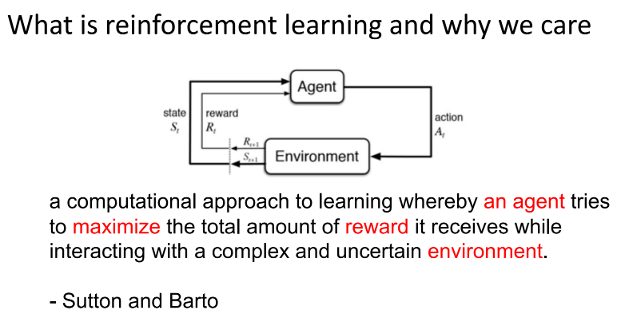

在强化学习过程中，agent 跟 environment 一直在交互。Agent 在环境里面获取到状态，agent 会利用这个状态输出一个动作(action)，一个决策。然后这个决策会放到环境之中去，环境会根据 agent 采取的决策，输出下一个状态以及当前的这个决策得到的奖励。

Agent 的目的就是为了尽可能多地从环境中获取奖励。

## 与监督学习（supervise learning）的对比

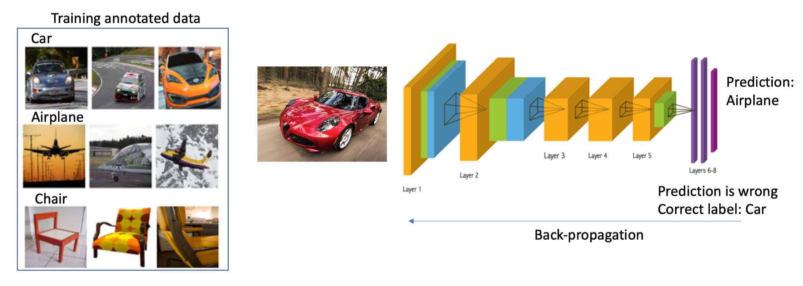

举个图片分类的例子，`监督学习(supervised learning)`就是说我们有一大堆标注的数据，比如车、飞机、凳子这些标注的图片，这些图片都要满足独立同分布(i.i.d.)，就是它们之间是没有关联的。

然后我们训练一个分类器，比如说右边这个神经网络。为了分辨出这个图片是车辆还是飞机，训练过程中，我们把真实的标签给了这个网络。当这个网络做出一个错误的预测，比如现在输入了汽车的图片，它预测出来是飞机。我们就会直接告诉它，你这个预测是错误的，正确的标签应该是车。然后我们把这个错误写成一个`损失函数(loss function)`，通过反向传播(Backpropagation)来训练这个网络。

所以在监督学习过程中，有两个假设：

- 输入的数据（标注的数据）都是没有关联的，尽可能没有关联。因为如果有关联的话，这个网络是不好学习的。
- 我们告诉学习器(learner)正确的标签是什么，这样它可以通过正确的标签来修正自己的预测。

但是在强化学习中，这两点都不满足。举一个 Atari Breakout 游戏的例子，这是一个打砖块的游戏，控制木板，然后把这个球反弹到上面来消除这些砖块

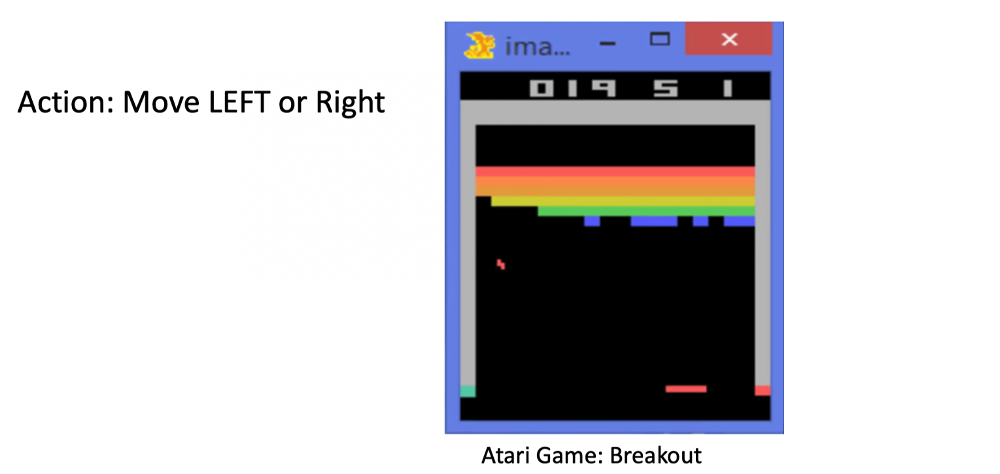

- 在游戏过程中，大家可以发现这个 agent 得到的观测不是个独立同分布的分布，上一帧下一帧其实有非常强的连续性。这就是说，得到的数据是相关的时间序列数据，不满足独立同分布。
- 另外一点，在玩游戏的过程中，你并没有立刻获得反馈，没有告诉你哪个动作是正确动作。比如你现在把这个木板往右移，那么只会使得这个球往上或者往左上去一点，你并不会得到立刻的反馈。所以强化学习这么困难的原因是没有得到很好的反馈，然后你依然希望 agent 在这个环境里面学习。

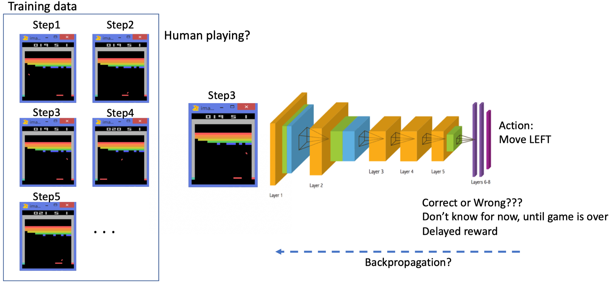

强化学习的训练数据就是这样一个玩游戏的过程。你从第一步开始，采取一个决策，比如说你把这个往右移，接到这个球了。第二步你又做出决策，得到的训练数据是一个玩游戏的序列。

比如现在是在第三步，你把这个序列放进去，你希望这个网络可以输出一个决策，在当前的这个状态应该输出往右移或者往左移。这里有个问题：我们没有标签来说明你现在这个动作是正确还是错误，必须等到游戏结束才可能说明，这个游戏可能十秒过后才结束。现在这个动作到底对最后游戏结束能赢是否有帮助，其实是不清楚的。这里就面临`延迟奖励(Delayed Reward)`，所以就使得训练这个网络非常困难。

**我们对比下强化学习和监督学习。**

- 强化学习输入的是序列数据，而不是像监督学习里面这些样本都是独立的。
- 学习器并没有被告诉你每一步正确的行为应该是什么。学习器需要自己去发现哪些行为可以得到最多的奖励，只能通过不停地尝试来发现最有利的动作。
- Agent 获得自己能力的过程中，其实是通过不断地试错探索(trial-and-error exploration)。
  - 探索(exploration)和利用(exploitation)是强化学习里面非常核心的一个问题。
  - 探索：你会去尝试一些新的行为，这些新的行为有可能会使你得到更高的奖励，也有可能使你一无所有。
  - 利用：采取你已知的可以获得最大奖励的行为，你就重复执行这个动作就可以了，因为你已经知道可以获得一定的奖励。
  - 因此，我们需要在探索和利用之间取得一个权衡（trade-off），这也是在监督学习里面没有的情况。
- 在强化学习过程中，没有非常强的监督者(supervisor)，只有一个`奖励信号(reward signal)`，并且这个奖励信号是延迟的，就是环境会在很久以后告诉你之前你采取的行为到底是不是有效的。Agent 在这个强化学习里面学习的话就非常困难，因为你没有得到即时反馈。当你采取一个行为过后，如果是监督学习，你就立刻可以获得一个指引，就说你现在做出了一个错误的决定，那么正确的决定应该是谁。而在强化学习里面，环境可能会告诉你这个行为是错误的，但是它并没有告诉你正确的行为是什么。而且更困难的是，它可能是在一两分钟过后告诉你错误，它再告诉你之前的行为到底行不行。所以这也是强化学习和监督学习不同的地方。

通过跟监督学习比较，我们可以总结出强化学习的一些特征。

- 强化学习有这个 `试错探索(trial-and-error exploration)`，它需要通过探索环境来获取对环境的理解。
- 强化学习 agent 会从环境里面获得延迟的奖励。
- 在强化学习的训练过程中，时间非常重要。因为你得到的数据都是有时间关联的(sequential data)，而不是独立同分布的。在机器学习中，如果观测数据有非常强的关联，其实会使得这个训练非常不稳定。这也是为什么在监督学习中，我们希望数据尽量是独立同分布，这样就可以消除数据之间的相关性。
- Agent 的行为会影响它随后得到的数据，这一点是非常重要的。在我们训练 agent 的过程中，很多时候我们也是通过正在学习的这个 agent 去跟环境交互来得到数据。所以如果在训练过程中，这个 agent 的模型很快死掉了，那会使得我们采集到的数据是非常糟糕的，这样整个训练过程就失败了。所以在强化学习里面一个非常重要的问题就是怎么让这个 agent 的行为一直稳定地提升。

为什么我们关注强化学习，其中非常重要的一点就是强化学习得到的模型可以有超人类的表现。

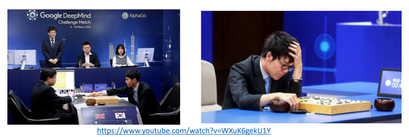

- 监督学习获取的这些监督数据，其实是让人来标注的。比如说 ImageNet 的图片都是人类标注的。那么我们就可以确定这个算法的上限(upper bound)就是人类的表现，人类的这个标注结果决定了它永远不可能超越人类。
- 但是对于强化学习，它在环境里面自己探索，有非常大的潜力，它可以获得超越人的能力的这个表现，比如谷歌 DeepMind 的 AlphaGo 这样一个强化学习的算法可以把人类最强的棋手都打败。

这里给大家举一些在现实生活中强化学习的例子。

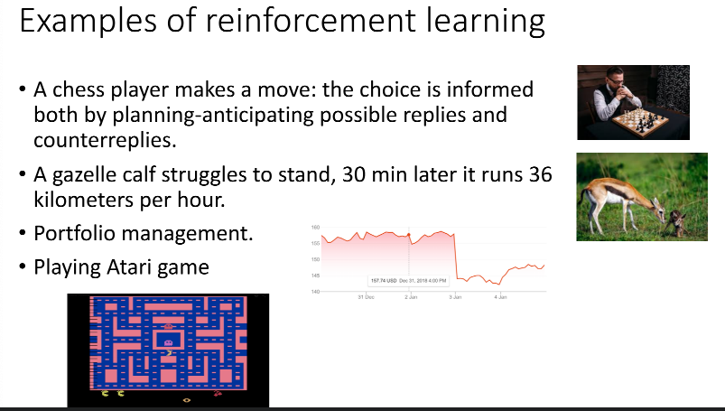

- 在自然界中，羚羊其实也是在做一个强化学习，它刚刚出生的时候，可能都不知道怎么站立，然后它通过试错的一个尝试，三十分钟过后，它就可以跑到每小时 36 公里，很快地适应了这个环境。
- 你也可以把股票交易看成一个强化学习的问题，就怎么去买卖来使你的收益极大化。
- 玩雅达利游戏或者一些电脑游戏，也是一个强化学习的过程。

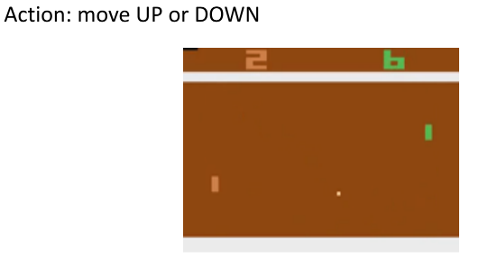

[flash观看地址](http://karpathy.github.io/2016/05/31/rl/)

上图是强化学习的一个经典例子，就是雅达利的一个叫 Pong 的游戏。这个游戏就是把这个球拍到左边，然后左边这个选手需要把这个球拍到右边。训练好的一个强化学习 agent 和正常的选手有区别，强化学习的 agent 会一直在做这种无意义的一些振动，而正常的选手不会出现这样的行为。

在这个 pong 的游戏里面，决策其实就是两个动作：往上或者往下。如果强化学习是通过学习一个 policy network 来分类的话，其实就是输入当前帧的图片，policy network 就会输出所有决策的可能性。

对于监督学习，我们可以直接告诉 agent 正确的标签是什么。但在这种游戏情况下面，我们并不知道它的正确的标签是什么。

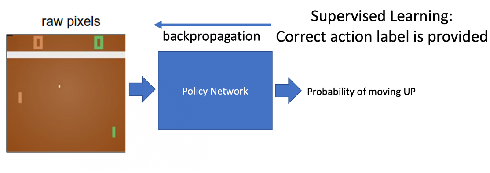

在强化学习里面，我们是通过让它尝试去玩这个游戏，然后直到游戏结束过后，再去说你前面的一系列动作到底是正确还是错误 (rollout)。

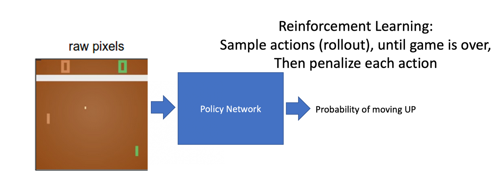

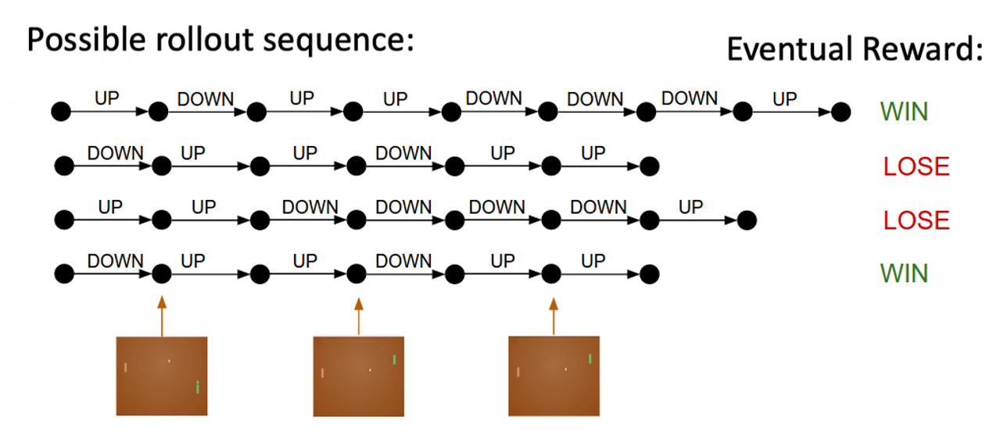

- 上图的过程是 `rollout` 的一个过程。Rollout 的意思是从当前帧去生成很多局的游戏。

- 当前的 agent 去跟环境交互，你就会得到一堆观测。你可以把每一个观测看成一个`轨迹(trajectory)`。轨迹就是当前帧以及它采取的策略，即状态和动作的一个序列：

  $\tau=\left(s_{0}, a_{0}, s_{1}, a_{1}, \ldots\right)$

- 最后结束过后，你会知道你到底有没有把这个球击到对方区域，对方没有接住，你是赢了还是输了。我们可以通过观测序列以及最终奖励(eventual reward)来训练这个 agent ，使它尽可能地采取可以获得这个最终奖励的动作。

- 一场游戏叫做一个 `episode(回合)` 或者 `trial(试验)`。

## RL与深度学习

强化学习是有一定的历史的，只是最近大家把强化学习跟深度学习结合起来，就形成了`深度强化学习(Deep Reinforcemet Learning)`。深度强化学习 = 深度学习 + 强化学习。这里做一个类比，把它类比于这个传统的计算机视觉以及深度计算机视觉。

- 传统的计算机视觉由两个过程组成。
  - 你给一张图，我们先要提取它的特征，用一些设计好的特征(feature)，比如说 HOG、DPM。
  - 提取这些特征后，我们再单独训练一个分类器。这个分类器可以是 SVM、Boosting，然后就可以辨别这张图片是狗还是猫。
- 2012 年过后，我们有了卷积神经网络，大家就把特征提取以及分类两者合到一块儿去了，就是训练一个神经网络。这个神经网络既可以做特征提取，也可以做分类。它可以实现这种端到端的训练，它里面的参数可以在每一个阶段都得到极大的优化，这样就得到了一个非常重要的突破。

我们可以把神经网络放到强化学习里面。

- Standard RL：之前的强化学习，比如 TD-Gammon 玩 backgammon 这个游戏，它其实是设计特征，然后通过训练价值函数的一个过程，就是它先设计了很多手工的特征，这个手工特征可以描述现在整个状态。得到这些特征过后，它就可以通过训练一个分类网络或者分别训练一个价值估计函数来做出决策。

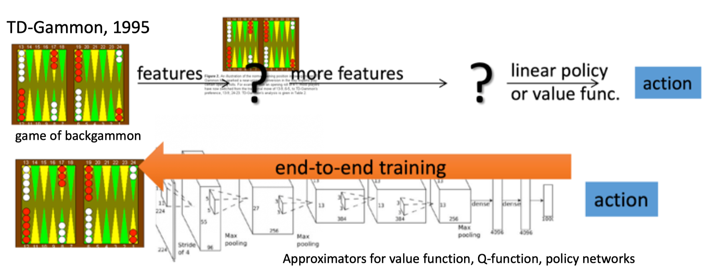

- Deep RL：现在我们有了深度学习，有了神经网络，那么大家也把这个过程改进成一个端到端训练(end-to-end training)的过程。你直接输入这个状态，我们不需要去手工地设计这个特征，就可以让它直接输出动作。那么就可以用一个神经网络来拟合我们这里的价值函数或策略网络，省去了特征工程(feature engineering)的过程。

为什么强化学习在这几年就用到各种应用中去，比如玩游戏以及机器人的一些应用，并且可以击败人类的最好棋手。

这有如下几点原因：

- 我们有了更多的计算能力(computation power)，有了更多的 GPU，可以更快地做更多的试错的尝试。
- 通过这种不同尝试使得 agent 在这个环境里面获得很多信息，然后可以在这个环境里面取得很大的奖励。
- 我们有了这个端到端的一个训练，可以把特征提取和价值估计或者决策一块来优化，这样就可以得到了一个更强的决策网络。

接下来给大家再看一些强化学习里面比较有意思的例子。

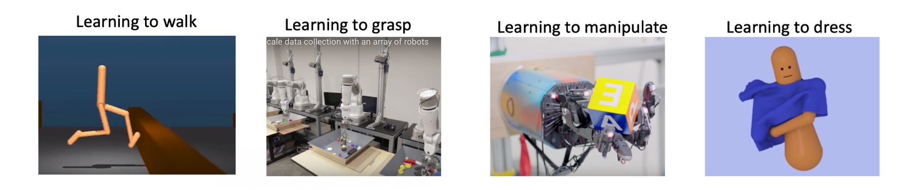

**[DeepMind 研发的一个走路的 agent](https://www.youtube.com/watch?v=gn4nRCC9TwQ)**

**[机械臂抓取](https://ai.googleblog.com/2016/03/deep-learning-for-robots-learning-from.html)**

**[OpenAI 做的一个机械臂翻魔方](https://www.youtube.com/watch?v=jwSbzNHGflM)**

**[一个穿衣服的 agent](https://www.youtube.com/watch?v=ixmE5nt2o88)** 

