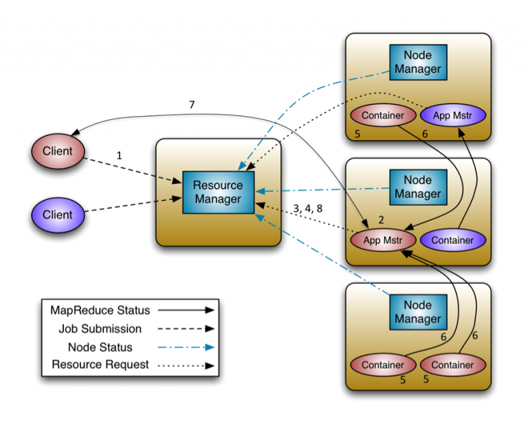
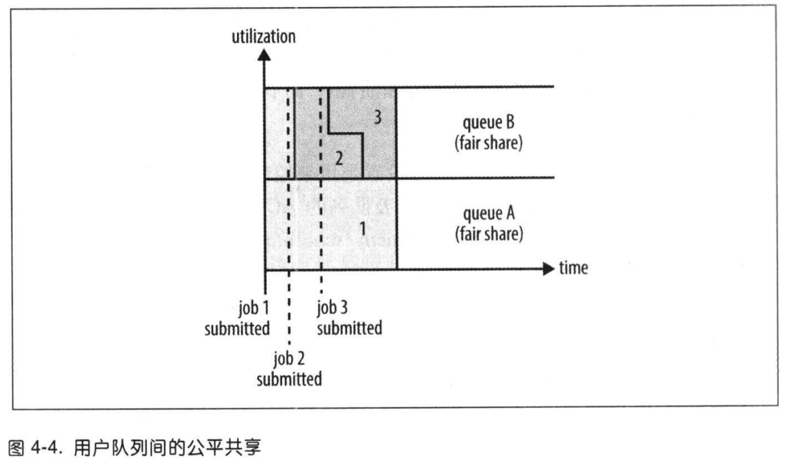
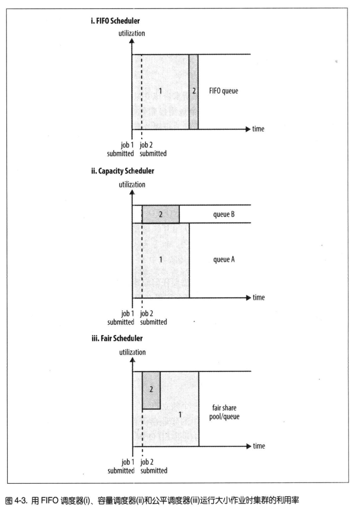

# YARN

Apache YARN（Yet Another Resource Negotiator）是Hadoop的集群资源管理系统。

YARN通过两类长期运行的守护进程提供自己的核心服务：

1. 管理集群上资源使用的**资源管理器**(resource manager)
2. 运行在集群中所有节点上且能够启动和监控**容器**（container）的**节点管理器**（node manager）

## 容器Container

容器是用于执行特定应用程序的进程，每个容器都有资源限制（内存，CPU核等），YARN将CPU核数和内存这些计算资源封装为容器。

* 容器由NodeManager启动和管理，并被它监控
* 容器由ResourceManager进行调度

## 资源管理器ResourceManager

负责资源管理、调度，主要包含两个主要的组件：

1. 定时调度器（Scheduler）：当客户端提交任务时，根据所需资源和集群当前资源状况进行分配。只负责向应用程序分配资源，不做应用程序的监控和状态跟踪
2. 应用管理器（ApplicationManager）：负责管理客户端用户提交的应用，对提交的应用进行监控和状态跟踪。

**ApplicationMaster**：每当 Client 提交一个 Application 时候，就会新建一个 ApplicationMaster 。由这个 ApplicationMaster 去与 ResourceManager 申请容器资源，获得资源后会将要运行的程序发送到容器上启动

资源管理器的功能：

1. 与客户端交互，处理来自客户端的请求。
2. 启动和管理ApplicatinMaster,并在它运行失败时重新启动它
3. NodeManager以心跳的方式向ResourceManager汇报资源使用情况，管理NodeManager，接受来自NodeManager的资源管理汇报信息，并向NodeManager下达管理命令(比如杀死Contanier)等
4. 资源管理与调度，接收来自ApplicationMaster的资源申请请求，并为之分配资源

## 节点管理器NodeManager

主要功能：

* NodeManager是每个节点上的资源和任务管理器，它是管理这台机器的代理，负责该节点程序的运行，以及该节点资源的管理和监控。YARN集群每个节点都运行一个NodeManager。
* NodeManager定时向ResourceManager汇报本节点资源（CPU、内存）的使用情况和Container的运行状态。当ResourceManager宕机时NodeManager自动连接RM备用节点。
* NodeManager接收并处理来自ApplicationMaster关于Container启动、停止等各种请求。

## YARN应用的运行机制



1. client向ResourceManager提交应用程序，其中包括启动该应用的ApplicationMaster的必须信息，例如ApplicationMaster程序、启动ApplicationMaster的命令、用户程序等。
2. ResourceManager启动一个container用于运行ApplicationMaster。
3. 启动中的ApplicationMaster向ResourceManager注册自己，启动成功后与ResourceManager保持心跳。
4. ApplicationMaster向ResourceManager发送请求，申请相应数目的container。
5. ResourceManager返回ApplicationMaster的申请的containers信息。申请成功的container，由ApplicationMaster进行初始化。container的启动信息初始化后，ApplicationMaster与对应的NodeManager通信，要求NodeManager启动container。ApplicationMaster与NodeManager保持心跳，从而对NodeManager上运行的任务进行监控和管理。
6. container运行期间，ApplicationMaster对container进行监控。container通过RPC协议向对应的ApplicationMaste汇报自己的进度和状态等信息。
7. 应用运行期间，client直接与ApplicationMaster通信获取应用的状态、进度更新等信息。
8. 应用运行结束后，ApplicationMaster向ResourceManager注销自己，并允许属于它的container被收回。

YARN应用可以在运行中的任意时刻提出资源申请，为了满足不断变化的应用需要，可以采取的方式在需要更多资源时提出请求。

## YARN的调度

理想情况下，YARN应用发出资源请求应该立刻给予满足，但是资源是有限的，所以YARN调度器的工作就是根据给定的策略为应用分配资源。

### 三种调度选项

### FIFO调度

FIFO调度器是将应用放在一个队列中，按照提交的顺序（先进先出）运行应用，大的应用会占用集群中的所有资源，所以每个应用必须等待直到轮到自己运行。不适合共享集群。

### 容量调度器

容量调度器允许多个组织共享一个Hadoop集群，每个组织考验分配到全部集群资源的一部分。每个组织被配置一个专门的队列，每个队列配置一定的集群资源。

例如，配置一个专门的队列保证小作业一提交就可以启动，由于队列容量是为该队列中任务所保留的，是以整个集群的利用率为代价的，与FIFO相比，大任务执行时间会更长。

当所需要的资源超过队列的容量，但是集群仍有空闲资源，可以配置capacity-scheduler.xml中的yarn.scheduler.capacity.<queue-path>.user-limit-factor大于1，可以使用超出队列限制的资源，此时队列为弹性队列。

也可以设置队列的最大容量限制，这样队列就不会占用别的队列的资源了。

队列的层次结构：

```
root
|--prod
|--dev
   |--eng
   |--science
```

队列名是队列层次名的最后一部分，完整的队列层次名不会被识别。

### 公平调度器

公平调度器会在所有运行的作业之间动态平衡资源，比如第一个大作业启动时，会占用集群所有资源，当第二个小作业启动时，会有一点滞后时间，然后获得集群一半的资源，小作业完成后，大作业又会再次使用全部的集群资源，保证较高的集群利用率，又能保证小作业能及时完成。

公平调度器也可以进行队列配置：



有队列A，B，A提交job1，会分配到全部可用的资源，B提交job2，经过一段滞后时间，job2用到了一半的资源，job1也用到的一半的资源，B再次提交job3，经过一段滞后时间，job2和job3分类占用集群四分之一的资源，job1仍占用一半的资源，这就是公平共享的队列。

每个队列还可以指定不同的调度策略。

### 三种调度器对比



### 抢占

抢占（preemption），当一个任务提交之后，在给定的时间内没有分配到最小的共享资源，那么运行调度器就会终止那些占用资源超过了公平共享份额的队列的容器，容器资源释放后可以分配给资源数量低于应得份额的队列，由于抢占行为会使被终止的容器重新执行，所以会降低整个集群效率。

通过设置yarn.scheduler.fair.preemption参数为true，可开启抢占功能。

### 延迟调度

延迟调度就是在一个繁忙的集群上，如果一个应用请求某个节点，可能有其他容器正运行在该节点上，但是通过实践发现，如果等待几秒，该应用在该节点上分配到容器的概率会增加，这样就提高了集群的效率。

容量调度器和公平调度器都支持延迟调度。

### 主导资源公平性

因为应用请求的资源类型不局限于内存，还有CPU核数等，所有当有多种资源类型需要调度时，就需要找到应用的主导资源。

例如一个集群有100个CPU和10T内存，应用A请求2 个CPU和300G内存，应用B请求6个CPU和100G内存，则A请求的资源占集群资源的占比分别为2%和3%，所以内存是A的主导资源（3%），B请求站集群资源的占比分别为6%和1%，所以CPU是B的主导资源（6%），B申请的主导资源时A的主导资源的2倍，所有B占有集群三分之二的资源，A占有三分之一。

## Quiz

1. YARN中资源管理器和节点管理器的作用
2. YARN应用的运行机制是怎样的？
3. YARN的三种调度器是如何给任务分配资源的？

