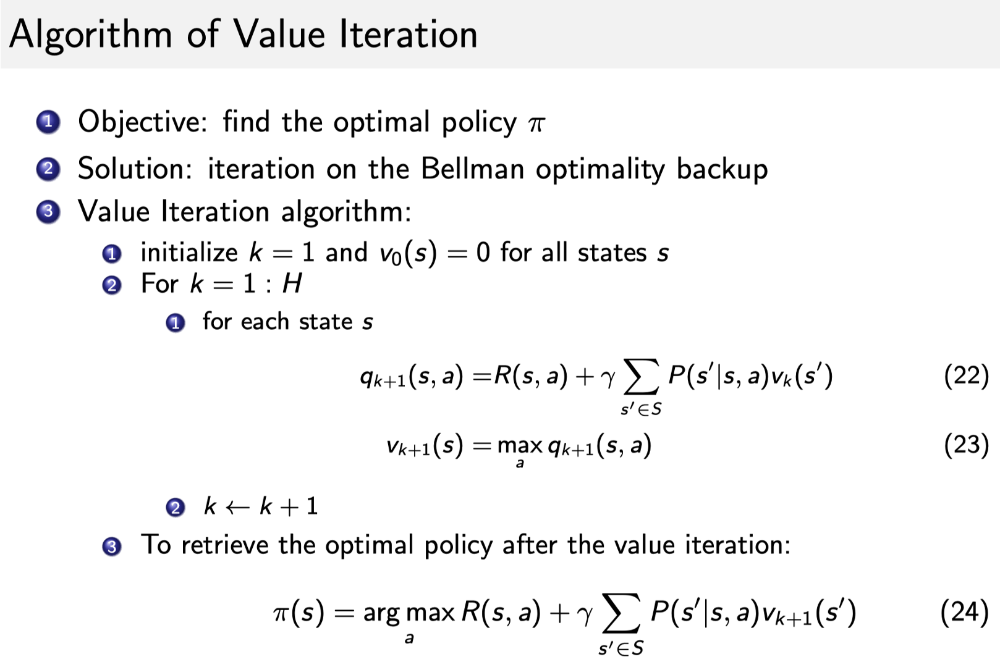

# 马尔科夫决策过程MDP

## 定义

**相对于 MRP，`马尔可夫决策过程(Markov Decision Process)`多了一个 `action\decision`，其它的定义跟 MRP 都是类似的**:

- 这里多了一个决策，多了一个动作。
- 状态转移也多了一个条件，变成了$ P\left(s_{t+1}=s^{\prime} \mid s_{t}=s, a_{t}=a\right)$。你采取某一种动作，然后你未来的状态会不同。未来的状态不仅是依赖于你当前的状态，也依赖于在当前状态 agent 采取的动作。
- 对于这个价值函数，它也是多了一个条件，多了一个你当前的动作，变成了$ R\left(s_{t}=s, a_{t}=a\right)=\mathbb{E}\left[r_{t} \mid s_{t}=s, a_{t}=a\right]$。你当前的状态以及你采取的动作会决定你在当前可能得到的奖励多少。

## 决策Policy

- Policy 定义了在某一个状态应该采取什么样的动作。

- 知道当前状态过后，我们可以把当前状态带入 policy function，然后就会得到一个概率，即

  $\pi(a \mid s)=P\left(a_{t}=a \mid s_{t}=s\right)$

概率就代表了在所有可能的动作里面怎样采取行动，比如可能有 0.7 的概率往左走，有 0.3 的概率往右走，这就是一个概率的表示。

- 另外这个策略也可能是确定的，它有可能是直接输出一个值。或者就直接告诉你当前应该采取什么样的动作，而不是一个动作的概率。
- 假设这个概率函数应该是平稳的(stationary)，不同时间点，你采取的动作其实都是对这个 policy function 进行的采样。

已知一个 MDP 和一个 policy $ \pi$ 的时候，我们可以把 MDP 转换成 MRP。在 MDP 里面，转移函数 $P(s'|s,a)$是基于它当前状态以及它当前的 action。因为我们现在已知它 policy function，就是说在每一个状态，我们知道它可能采取的动作的概率，那么就可以直接把这个 action 进行加和，直接把这个 a 去掉，那我们就可以得到对于 MRP 的一个转移，这里就没有 action。对于这个奖励函数，我们也可以把 action 拿掉，这样就会得到一个类似于 MRP 的奖励函数。

## MRP vs MDP

**这里我们看一看，MDP 里面的状态转移跟 MRP 以及 MP 的差异。**

- 马尔可夫过程的转移是直接就决定。比如当前状态是 s，那么就直接通过这个转移概率决定了下一个状态是什么。
- 但对于 MDP，它的中间多了一层这个动作 a ，就是说在你当前这个状态的时候，首先要决定的是采取某一种动作，那么你会到了某一个黑色的节点。到了这个黑色的节点，因为你有一定的不确定性，当你当前状态决定过后以及你当前采取的动作过后，你到未来的状态其实也是一个概率分布。**所以在这个当前状态跟未来状态转移过程中这里多了一层决策性，这是 MDP 跟之前的马尔可夫过程很不同的一个地方。**在马尔可夫决策过程中，动作是由 agent 决定，所以多了一个组成部分，agent 会采取动作来决定未来的状态转移。

## MDP的价值函数 Value function

顺着 MDP 的定义，我们可以把 `状态-价值函数(state-value function)`，就是在 MDP 里面的价值函数也进行一个定义，它的定义是跟 MRP 是类似的，如式 (3) 所示：
$$
v^{\pi}(s)=\mathbb{E}_{\pi}\left[G_{t} \mid s_{t}=s\right] \tag{3}
$$
但是这里 expectation over policy，就是这个期望是基于你采取的这个 policy ，就是当 policy 决定过后，**我们通过对这个 policy 进行采样来得到一个期望，那么就可以计算出这个价值函数。**

这里我们另外引入了一个 `Q 函数(Q-function)`。Q 函数也被称为 `action-value function`。**Q 函数定义的是在某一个状态采取某一个动作，它有可能得到的这个 return 的一个期望**，如式 (4) 所示：
$$
q^{\pi}(s, a)=\mathbb{E}_{\pi}\left[G_{t} \mid s_{t}=s, A_{t}=a\right] \tag{4}
$$
这里期望其实也是 over policy function。所以你需要对这个 policy function 进行一个加和，然后得到它的这个价值。 **对 Q 函数中的动作函数进行加和，就可以得到价值函数**，如式 (5) 所示（Q函数与价值函数的关系）：
$$
v^{\pi}(s)=\sum_{a \in A} \pi(a \mid s) q^{\pi}(s, a) \tag{5}
$$

### Q 函数Bellman Equation

$$
\begin{aligned} q(s,a)&=\mathbb{E}\left[G_{t} \mid s_{t}=s,a_{t}=a\right]\\ &=\mathbb{E}\left[R_{t+1}+\gamma R_{t+2}+\gamma^{2} R_{t+3}+\ldots \mid s_{t}=s,a_{t}=a\right] \\ &=\mathbb{E}\left[R_{t+1}|s_{t}=s,a_{t}=a\right] +\gamma \mathbb{E}\left[R_{t+2}+\gamma R_{t+3}+\gamma^{2} R_{t+4}+\ldots \mid s_{t}=s,a_{t}=a\right]\\ &=R(s,a)+\gamma \mathbb{E}[G_{t+1}|s_{t}=s,a_{t}=a] \\ &=R(s,a)+\gamma \mathbb{E}[V(s_{t+1})|s_{t}=s,a_{t}=a]\\ &=R(s,a)+\gamma \sum_{s^{\prime} \in S} P\left(s^{\prime} \mid s,a\right) V\left(s^{\prime}\right) \end{aligned}
$$

**我们可以把状态-价值函数和 Q 函数拆解成两个部分：即时奖励(immediate reward) 和后续状态的折扣价值(discounted value of successor state)。**

### Bellman Expectation Equation

通过对状态-价值函数进行一个分解，我们就可以得到一个类似于之前 MRP 的 Bellman Equation，这里叫 `Bellman Expectation Equation`，如式 (6) 所示：
$$
v^{\pi}(s)=E_{\pi}\left[R_{t+1}+\gamma v^{\pi}\left(s_{t+1}\right) \mid s_{t}=s\right] \tag{6}
$$
对于 Q 函数，我们也可以做类似的分解，也可以得到 Q 函数的 Bellman Expectation Equation，如式 (7) 所示：
$$
q^{\pi}(s, a)=E_{\pi}\left[R_{t+1}+\gamma q^{\pi}\left(s_{t+1}, A_{t+1}\right) \mid s_{t}=s, A_{t}=a\right] \tag{7}
$$
**Bellman expectation equation 定义了当前状态跟未来状态之间的一个关联。**

我们进一步进行一个简单的分解。

我们先给出等式 (8)：
$$
v^{\pi}(s)=\sum_{a \in A} \pi(a \mid s) q^{\pi}(s, a) \tag{8}
$$
再给出等式 (9)：
$$
q^{\pi}(s, a)=R_{s}^{a}+\gamma \sum_{s^{\prime} \in S} P\left(s^{\prime} \mid s, a\right) v^{\pi}\left(s^{\prime}\right) \tag{9}
$$
**等式 (8) 和等式 (9) 代表了价值函数跟 Q 函数之间的一个关联。**

也可以把等式 (9) 插入等式 (8) 中，得到等式 (10)：
$$
v^{\pi}(s)=\sum_{a \in A} \pi(a \mid s)\left(R(s, a)+\gamma \sum_{s^{\prime} \in S} P\left(s^{\prime} \mid s, a\right) v^{\pi}\left(s^{\prime}\right)\right) \tag{10}
$$
**等式 (10) 代表了当前状态的价值跟未来状态价值之间的一个关联。**

我们把等式 (8) 插入到等式 (9)，就可以得到等式 (11)：
$$
q^{\pi}(s, a)=R(s, a)+\gamma \sum_{s^{\prime} \in S} P\left(s^{\prime} \mid s, a\right) \sum_{a^{\prime} \in A} \pi\left(a^{\prime} \mid s^{\prime}\right) q^{\pi}\left(s^{\prime}, a^{\prime}\right) \tag{11}
$$
**等式 (11) 代表了当前时刻的 Q 函数跟未来时刻的 Q 函数之间的一个关联。**

**等式 (10) 和等式 (11) 是 Bellman expectation equation 的另一种形式。**

## Policy Evaluation （Prediction）

- 当我们知道一个 MDP 以及要采取的策略$ \pi$ ，计算价值函数$ v^{\pi}(s)$的过程就是 `policy evaluation`。就像我们在评估这个策略，我们会得到多大的奖励。
- **Policy evaluation 在有些地方也被叫做 `(value) prediction`，也就是预测你当前采取的这个策略最终会产生多少的价值。**

### Example

- MDP，你其实可以把它想象成一个摆渡的人在这个船上面，她可以控制这个船的移动，这样就避免了这个船随波逐流。因为在每一个时刻，这个人会决定采取什么样的一个动作，这样会把这个船进行导向。
- MRP 跟 MP 的话，这个纸的小船会随波逐流，然后产生轨迹。
- MDP 的不同就是有一个 agent 去控制这个船，这样我们就可以尽可能多地获得奖励。

我们再看下 policy evaluation 的例子，怎么在决策过程里面计算它每一个状态的价值。

- 假设环境里面有两种动作：往左走和往右走。

- 现在的奖励函数应该是关于动作以及状态两个变量的一个函数。但我们这里规定，不管你采取什么动作，只要到达状态 $s_1$，就有 5 的奖励。只要你到达状态 $s_7$ 了，就有 10 的奖励，中间没有任何奖励。

- 假设我们现在采取的一个策略，这个策略是说不管在任何状态，我们采取的策略都是往左走。假设价值折扣因子是零，那么对于确定性策略(deterministic policy)，最后估算出的价值函数是一致的，即
  $$
  V^{\pi}=[5,0,0,0,0,0,10]
  $$

直接在去 run 下面这个 iterative equation：
$$
v_{k}^{\pi}(s)=r(s, \pi(s))+\gamma \sum_{s^{\prime} \in S} P\left(s^{\prime} \mid s, \pi(s)\right) v_{k-1}^{\pi}\left(s^{\prime}\right)
$$
就把 Bellman expectation equation 拿到这边来，然后不停地迭代，最后它会收敛。收敛过后，它的值就是它每一个状态的价值。

再来看一个例子(eg 1)，如果折扣因子是 0.5，我们可以通过下面这个等式进行迭代：
$$
v_{t}^{\pi}(s)=\sum_{a} P(\pi(s)=a)\left(r(s, a)+\gamma \sum_{s^{\prime} \in S} P\left(s^{\prime} \mid s, a\right) v_{t-1}^{\pi}\left(s^{\prime}\right)\right)
$$
然后就会得到它的状态价值。

另外一个例子(eg 2)，就是说我们现在采取的 policy 在每个状态下，有 0.5 的概率往左走，有 0.5 的概率往右走，那么放到这个状态里面去如何计算。其实也是把这个 Bellman expectation equation 拿出来，然后进行迭代就可以算出来了。一开始的时候，我们可以初始化，不同的$ v(s')$ 都会有一个值，放到 Bellman expectation equation 里面去迭代，然后就可以算出它的状态价值。

## Prediction and Control

MDP 的 `prediction` 和 `control` 是 MDP 里面的核心问题。

- 预测问题：
  - 输入：MDP $<S,A,P,R,\gamma>$和 policy $\pi$ 或者 MRP $<S,P^{\pi},R^{\pi},\gamma>$。
  - 输出：value function $v^{\pi}$。
  - Prediction 是说给定一个 MDP 以及一个 policy $\pi$ ，去计算它的 value function，就对于每个状态，它的价值函数是多少。
- 控制问题：
  - 输入：MDP $<S,A,P,R,\gamma>$。
  - 输出：最佳价值函数(optimal value function) $v^*$ 和最佳策略(optimal policy) $\pi^*$。
  - Control 就是说我们去寻找一个最佳的策略，然后同时输出它的最佳价值函数以及最佳策略。
- 在 MDP 里面，prediction 和 control 都可以通过动态规划去解决。
- 要强调的是，这两者的区别就在于，
  - 预测问题是**给定一个 policy**，我们要确定它的 value function 是多少。
  - 而控制问题是在**没有 policy 的前提下**，我们要确定最优的 value function 以及对应的决策方案。
- **实际上，这两者是递进的关系，在强化学习中，我们通过解决预测问题，进而解决控制问题。**

### DP (supply)

`动态规划(Dynamic Programming，DP)`适合解决满足如下两个性质的问题：

- `最优子结构(optimal substructure)`。最优子结构意味着，我们的问题可以拆分成一个个的小问题，通过解决这个小问题，最后，我们能够通过组合小问题的答案，得到大问题的答案，即最优的解。
- `重叠子问题(Overlapping subproblems)`。重叠子问题意味着，子问题出现多次，并且子问题的解决方案能够被重复使用。

MDP 是满足动态规划的要求的，

- 在 Bellman equation 里面，我们可以把它分解成一个递归的结构。当我们把它分解成一个递归的结构的时候，如果我们的子问题子状态能得到一个值，那么它的未来状态因为跟子状态是直接相连的，那我们也可以继续推算出来。
- 价值函数就可以储存并重用它的最佳的解。

动态规划应用于 MDP 的规划问题(planning)而不是学习问题(learning)，我们必须对环境是完全已知的(Model-Based)，才能做动态规划，直观的说，就是要知道状态转移概率和对应的奖励才行(leetcode 一堆这样的题)

动态规划能够完成预测问题和控制问题的求解，是解 MDP prediction 和 control 一个非常有效的方式。

Policy evaluation 的核心思想就是把如下式所示的 Bellman expectation equation 拿出来反复迭代，然后就会得到一个收敛的价值函数的值。
$$
v_{t+1}(s)=\sum_{a \in \mathcal{A}} \pi(a \mid s)\left(R(s, a)+\gamma \sum_{s^{\prime} \in \mathcal{S}} P\left(s^{\prime} \mid s, a\right) v_{t}\left(s^{\prime}\right)\right)
$$
因为已经给定了这个函数的 policy function，那我们可以直接把它简化成一个 MRP 的表达形式，这样的话，形式就更简洁一些，就相当于我们把这个 $a$ 积掉，如下式所示：
$$
v_{t+1}(s)=R^{\pi}(s)+\gamma P^{\pi}\left(s^{\prime} \mid s\right) v_{t}\left(s^{\prime}\right)
$$
这样它就只有价值函数跟转移函数了。通过去迭代这个更简化的一个函数，我们也可以得到它每个状态的价值。因为不管是在 MRP 以及 MDP，它的价值函数包含的这个变量都是只跟这个状态有关，就相当于进入某一个状态，未来可能得到多大的价值。

## MDP Control

Policy evaluation 是说给定一个 MDP 和一个 policy，我们可以估算出它的价值函数。**还有问题是说如果我们只有一个 MDP，如何去寻找一个最佳的策略，然后可以得到一个`最佳价值函数(Optimal Value Function)`。**

Optimal Value Function 的定义如下式所示：
$$
v^{*}(s)=\max _{\pi} v^{\pi}(s)
$$
Optimal Value Function 是说，我们去搜索一种 policy $\pi$ 来让每个状态的价值最大。$v^*$ 就是到达每一个状态，它的值的极大化情况。

在这种极大化情况上面，我们得到的策略就可以说它是`最佳策略(optimal policy)`，如下式所示：
$$
\pi^{*}(s)=\underset{\pi}{\arg \max }~ v^{\pi}(s)
$$
Optimal policy 使得每个状态的价值函数都取得最大值。所以如果我们可以得到一个 optimal value function，就可以说某一个 MDP 的环境被解。在这种情况下，它的最佳的价值函数是一致的，就它达到的这个上限的值是一致的，但这里可能有多个最佳的 policy，就是说多个 policy 可以取得相同的最佳价值。

### 寻找最佳的 policy

当取得最佳的价值函数过后，我们可以通过对这个 Q 函数进行极大化，然后得到最佳策略。当所有东西都收敛过后，因为 Q 函数是关于状态跟动作的一个函数，所以在某一个状态采取一个动作，可以使得这个 Q 函数最大化，那么这个动作就应该是最佳的动作。所以如果我们能优化出一个 Q 函数，就可以直接在这个 Q 函数上面取一个让 Q 函数最大化的 action 的值，就可以提取出它的最佳策略。

**寻找这个最佳策略的过程就是 MDP control 过程**。MDP control 说的就是怎么去寻找一个最佳的策略来让我们得到一个最大的价值函数，如下式所示：
$$
\pi^{*}(s)=\underset{\pi}{\arg \max } ~ v^{\pi}(s)
$$
对于一个事先定好的 MDP 过程，当 agent 去采取最佳策略的时候，我们可以说最佳策略一般都是确定的，而且是稳定的(它不会随着时间的变化)。但是不一定是唯一的，多种动作可能会取得相同的这个价值。

### 穷举

最简单的策略搜索办法就是`穷举`。假设状态和动作都是有限的，那么每个状态我们可以采取这个 A 种动作的策略，那么总共就是 $|A|^{|S|}$个可能的 policy。那我们可以把策略都穷举一遍，然后算出每种策略的 value function，对比一下就可以得到最佳策略。

但是穷举非常没有效率，所以我们要采取其他方法。**搜索最佳策略有两种常用的方法：policy iteration 和 value iteration**。

### Policy Iteration

**Policy iteration 由两个步骤组成：policy evaluation 和 policy improvement。**

- **第一个步骤是 policy evaluation**，当前我们在优化这个 policy $\pi$，在优化过程中得到一个最新的 policy。我们先保证这个 policy 不变，然后去估计它出来的这个价值。给定当前的 policy function 来估计这个$ v$ 函数。
- **第二个步骤是 policy improvement**，得到$ v$ 函数过后，我们可以进一步推算出它的 Q 函数。得到 Q 函数过后，我们直接在 Q 函数上面取极大化，通过在这个 Q 函数上面做一个贪心的搜索来进一步改进它的策略。
- 这两个步骤就一直是在迭代进行，所以在 policy iteration 里面，在初始化的时候，我们有一个初始化的$ V$ 和 $\pi$ ，然后就是在这两个过程之间迭代。

左边这幅图上面的线就是我们当前 v 的值，下面的线是 policy 的值。

- 跟踢皮球一样，我们先给定当前已有的这个 policy function，然后去算它的 v。
- 算出 v 过后，我们会得到一个 Q 函数。Q 函数我们采取 greedy 的策略，这样就像踢皮球，踢回这个 policy 。
- 然后进一步改进那个 policy ，得到一个改进的 policy 过后，它还不是最佳的，我们再进行 policy evaluation，然后又会得到一个新的 value function。基于这个新的 value function 再进行 Q 函数的极大化，这样就逐渐迭代，然后就会得到收敛。

这里再来看一下第二个步骤： `policy improvement`，我们是如何改进它的这个策略。得到这个 v 值过后，我们就可以通过这个 reward function 以及状态转移把它的这个 Q-function 算出来，如下式所示：
$$
q^{\pi_{i}}(s, a)=R(s, a)+\gamma \sum_{s^{\prime} \in S} P\left(s^{\prime} \mid s, a\right) v^{\pi_{i}}\left(s^{\prime}\right)
$$
对于每一个状态，第二个步骤会得到它的新一轮的这个 policy ，就在每一个状态，我们去取使它得到最大值的 action，如下式所示：
$$
\pi_{i+1}(s)=\underset{a}{\arg \max } ~q^{\pi_{i}}(s, a)
$$

**你可以把 Q 函数看成一个 Q-table:**

- 横轴是它的所有状态，
- 纵轴是它的可能的 action。

得到 Q 函数后，`Q-table`也就得到了。

那么对于某一个状态，每一列里面我们会取最大的那个值，最大值对应的那个 action 就是它现在应该采取的 action。所以 arg max 操作就说在每个状态里面采取一个 action，这个 action 是能使这一列的 Q 最大化的那个动作。

有效性：当一直在采取 arg max 操作的时候，我们会得到一个单调的递增价值函数。通过采取这种 greedy，即 arg max 操作，我们就会得到更好的或者不变的 policy，而不会使它这个价值函数变差。所以当这个改进停止过后，我们就会得到一个最佳策略。

当改进停止过后，我们取它最大化的这个 action，它直接就会变成它的价值函数，如下式所示：
$$
q^{\pi}\left(s, \pi^{\prime}(s)\right)=\max _{a \in \mathcal{A}} q^{\pi}(s, a)=q^{\pi}(s, \pi(s))=v^{\pi}(s)
$$
所以我们有了一个新的等式：
$$
v^{\pi}(s)=\max _{a \in \mathcal{A}} q^{\pi}(s, a)
$$
上式被称为 `Bellman optimality equation`。从直觉上讲，Bellman optimality equation 表达了这样一个事实：最佳策略下的一个状态的价值必须等于在这个状态下采取最好动作得到的回报的期望。

**当 MDP 满足 Bellman optimality equation 的时候，整个 MDP 已经到达最佳的状态。**它到达最佳状态过后，对于这个 Q 函数，取它最大的 action 的那个值，就是直接等于它的最佳的 value function。只有当整个状态已经收敛过后，得到一个最佳的 policy 的时候，这个条件才是满足的。

最佳的价值函数到达过后，这个 Bellman optimlity equation 就会满足。

互相代入：

### Value Iteration

**Value iteration 就是把 Bellman Optimality Equation 当成一个 update rule 来进行，**如下式所示：
$$
v(s) \leftarrow \max _{a \in \mathcal{A}}\left(R(s, a)+\gamma \sum_{s^{\prime} \in \mathcal{S}} P\left(s^{\prime} \mid s, a\right) v\left(s^{\prime}\right)\right)
$$
之前我们说上面这个等式只有当整个 MDP 已经到达最佳的状态时才满足。但这里可以把它转换成一个 迭代的等式。**我们不停地去迭代 Bellman Optimality Equation，到了最后，它能逐渐趋向于最佳的策略，这是 value iteration 算法的精髓。**

为了得到最佳的 $v^*$ ，对于每个状态的 $v^*$，我们直接把这个 Bellman Optimality Equation 进行迭代，迭代了很多次之后，它就会收敛。

- 我们使用 value iteration 算法是为了得到一个最佳的策略。
- 解法：我们可以直接把 `Bellman Optimality equation` 这个等式拿进来进行迭代，迭代很多次，收敛过后得到的那个值就是它的最佳的值。
- 这个算法开始的时候，它是先把所有值初始化，通过每一个状态，然后它会进行这个迭代。把等式 (22) 代入到等式 (23) 里面，就是 Bellman optimality equation 那个等式。有了等式 (22) 和等式 (23) 过后，然后进行不停地迭代，迭代过后，然后收敛，收敛后就会得到这个$ v^*$ 。当我们有了 $v^*$ 过后，一个问题是如何进一步推算出它的最佳策略。
- 提取最佳策略的话，我们可以直接用 arg max。就先把它的 Q 函数重构出来，重构出来过后，每一个列对应的最大的那个 action 就是它现在的最佳策略。这样就可以从最佳价值函数里面提取出最佳策略。
- 我们只是在解决一个 planning 的问题，而不是强化学习的问题，因为我们知道环境如何变化。

- value function 做的工作类似于 value 的反向传播，每次迭代做一步传播，所以中间过程的 policy 和 value function 是没有意义的。不像是 policy iteration，它每一次迭代的结果都是有意义的，都是一个完整的 policy。

- 上图是一个可视化的过程，在一个 gridworld 中，我们设定了一个终点(goal)，也就是左上角的点。不管你在哪一个位置开始，我们都希望能够到终点（实际上这个终点是在迭代过程中不必要的，只是为了更好的演示）。Value iteration 的迭代过程像是一个从某一个状态（这里是我们的 goal）反向传播其他各个状态的过程。因为每次迭代只能影响到与之直接相关的状态。
- 以上图为例，实际上，对于每一个状态，我们都可以看成一个终点。迭代由每一个终点开始，每次都根据 Bellman optimality equation 重新计算 value。如果它的相邻节点 value 发生变化，变得更好，那么它也会变得更好，一直到相邻节点都不变了。因此，**在我们迭代到** $v_7$ **之前，也就是还没将每个终点的最优的 value 传递给其他的所有状态之前，中间的几个 value function 只是一种暂存的不完整的数据，它不能代表每一个 state 的 value function，所以生成的 policy 是一个没有意义的 policy**。
- 因为它是一个迭代过程，这里可视化了从 $v_1$ 到$ v_7$ 每一个状态的值的变化，它的这个值逐渐在变化。而且因为它每走一步，就会得到一个负的值，所以它需要尽快地到达左上角，可以发现离它越远的，那个值就越小。
- $v_7$ 收敛过后，右下角那个值是 -6，相当于它要走六步，才能到达最上面那个值。而且离目的地越近，它的价值越大。

## Example

[Demo](https://cs.stanford.edu/people/karpathy/reinforcejs/gridworld_dp.html)

