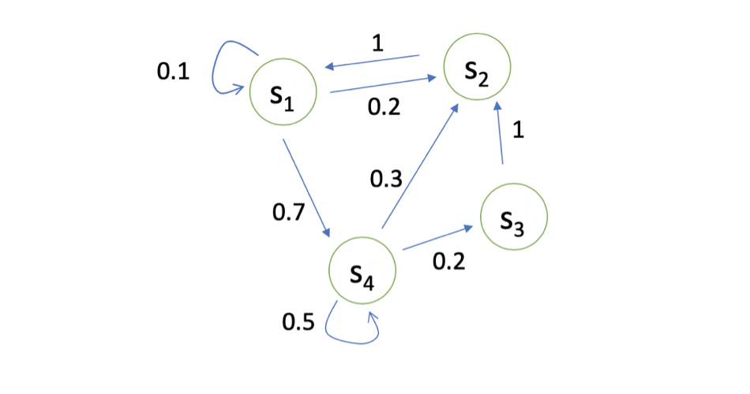

# 马尔科夫奖励过程MRP

## Markov Process/Chain

### 马尔科夫性 Markov property

如果一个状态转移是具有马尔可夫性质的，那就是说一个状态的下一个状态只取决于它当前状态，而跟它当前状态之前的状态都没有关系。

我们设状态的历史为 $h_{t}=\left\{s_{1}, s_{2}, s_{3}, \ldots, s_{t}\right\}$（$h_t$ 包含了之前的所有状态），如果一个状态转移是符合马尔可夫的，也就是满足如下条件：
$$
p\left(s_{t+1} \mid s_{t}\right) =p\left(s_{t+1} \mid h_{t}\right) \tag{1}
$$

$$
p\left(s_{t+1} \mid s_{t}, a_{t}\right) =p\left(s_{t+1} \mid h_{t}, a_{t}\right) \tag{2}
$$

从当前 $s_t$转移到 $s_{t+1}$ 这个状态，它是直接就等于它之前所有的状态转移到$ s_{t+1}$。如果某一个过程满足`马尔可夫性质(Markov Property)`，就是说未来的转移跟过去是独立的，它只取决于现在。**马尔可夫性质是所有马尔可夫过程的基础。**

举个例子，这个图里面有四个状态，这四个状态从 $s_1,s_2,s_3,s_4$之间互相转移。比如说从 $s_1$ 开始，

- $s_1$ 有 0.1 的概率继续存活在 $s_1$ 状态，
- 有 0.2 的概率转移到 $s_2$，
- 有 0.7 的概率转移到 $s_4$ 。

如果 $s_4$ 是我们当前状态的话，

- 它有 0.3 的概率转移到 $s_2$ ，
- 有 0.2 的概率转移到 $s_3$ ，
- 有 0.5 的概率留在这里。

我们可以用`状态转移矩阵(State Transition Matrix)` PP 来描述状态转移 $p\left(s_{t+1}=s^{\prime} \mid s_{t}=s\right)$，如下式所示。
$$
P=\left[\begin{array}{cccc} P\left(s_{1} \mid s_{1}\right) & P\left(s_{2} \mid s_{1}\right) & \ldots & P\left(s_{N} \mid s_{1}\right) \\ P\left(s_{1} \mid s_{2}\right) & P\left(s_{2} \mid s_{2}\right) & \ldots & P\left(s_{N} \mid s_{2}\right) \\ \vdots & \vdots & \ddots & \vdots \\ P\left(s_{1} \mid s_{N}\right) & P\left(s_{2} \mid s_{N}\right) & \ldots & P\left(s_{N} \mid s_{N}\right) \end{array}\right]
$$
状态转移矩阵类似于一个 conditional probability，当我们知道当前我们在$ s_t$这个状态过后，到达下面所有状态的一个概念。所以它每一行其实描述了是从一个节点到达所有其它节点的概率。

### Example

上图是一个马尔可夫链的例子，我们这里有七个状态。比如说从$ s_1$ 开始到 $s_2$ ，它有 0.4 的概率，然后它有 0.6 的概率继续存活在它当前的状态。 $s_2$ 有 0.4 的概率到左边，有 0.4 的概率到 $s_3$ ，另外有 0.2 的概率存活在现在的状态，所以给定了这个状态转移的马尔可夫链后，我们可以对这个链进行采样，这样就会得到一串的轨迹。

## Markov Reward Process

**`马尔可夫奖励过程(Markov Reward Process, MRP)` 是马尔可夫链再加上了一个奖励函数。**在 MRP 中，转移矩阵跟它的这个状态都是跟马尔可夫链一样的，多了一个`奖励函数(reward function)`。**奖励函数是一个期望**，就是说当你到达某一个状态的时候，可以获得多大的奖励，然后这里另外定义了一个 discount factor $\gamma$。	

### Example

这里是我们刚才看的马尔可夫链，如果把奖励也放上去的话，就是说到达每一个状态，我们都会获得一个奖励。这里我们可以设置对应的奖励，比如说到达$ s_1$ 状态的时候，可以获得 5 的奖励，到达 $s_7$ 的时候，可以得到 10 的奖励，其它状态没有任何奖励。因为这里状态是有限的，所以我们可以用向量 $R=[5,0,0,0,0,0,10]$ 来表示这个奖励函数，这个向量表示了每个点的奖励大小。

我们通过一个形象的例子来理解 MRP。我们把一个纸船放到河流之中，那么它就会随着这个河流而流动，它自身是没有动力的。所以你可以把 MRP 看成是一个随波逐流的例子，当我们从某一个点开始的时候，这个纸船就会随着事先定义好的状态转移进行流动，它到达每个状态过后，我们就有可能获得一些奖励。

### Return and Value function

- `Horizon` 是指一个回合的长度（每个回合最大的时间步数），它是由有限个步数决定的。
- `Return(回报)` 说的是把奖励进行折扣后所获得的收益。Return 可以定义为奖励的逐步叠加，如下式所示：

$$
G_{t}=R_{t+1}+\gamma R_{t+2}+\gamma^{2} R_{t+3}+\gamma^{3} R_{t+4}+\ldots+\gamma^{T-t-1} R_{T}
$$

这里有一个叠加系数，越往后得到的奖励，折扣得越多。这说明我们其实更希望得到现有的奖励，未来的奖励就要把它打折扣。

- 当我们有了 return 过后，就可以定义一个状态的价值了，就是 `state value function`。对于 MRP，state value function 被定义成是 return 的期望，如下式所示：
  $$
  \begin{aligned} V_{t}(s) &=\mathbb{E}\left[G_{t} \mid s_{t}=s\right] \\ &=\mathbb{E}\left[R_{t+1}+\gamma R_{t+2}+\gamma^{2} R_{t+3}+\ldots+\gamma^{T-t-1} R_{T} \mid s_{t}=s\right] \end{aligned}
  $$

$G_t$是之前定义的 `discounted return`，我们这里取了一个期望，期望就是说从这个状态开始，你有可能获得多大的价值。所以这个期望也可以看成是对未来可能获得奖励的当前价值的一个表现，就是当你进入某一个状态过后，你现在就有多大的价值。

### Why discount factor?

- 有些马尔可夫过程是带环的，它并没有终结，我们想避免这个无穷的奖励。
- 我们并没有建立一个完美的模拟环境的模型，也就是说，我们对未来的评估不一定是准确的，我们不一定完全信任我们的模型，因为这种不确定性，所以我们对未来的预估增加一个折扣。我们想把这个不确定性表示出来，希望尽可能快地得到奖励，而不是在未来某一个点得到奖励。
- 如果这个奖励是有实际价值的，我们可能是更希望立刻就得到奖励，而不是后面再得到奖励（现在的钱比以后的钱更有价值）。
- 在人的行为里面来说的话，大家也是想得到即时奖励。
- 有些时候可以把这个系数设为 0，$\gamma=0$：我们就只关注了它当前的奖励。我们也可以把它设为 1，$\gamma=1$：对未来并没有折扣，未来获得的奖励跟当前获得的奖励是一样的。

Discount factor 可以作为强化学习 agent 的一个超参数来进行调整，然后就会得到不同行为的 agent。

这里就引出了一个问题，当我们有了一些轨迹的实际 return，怎么计算它的价值函数。比如说在之前的例子中我们想知道$ s_4$状态的价值，就是当你进入$ s_4$ 后，它的价值到底如何。一个可行的做法就是说我们可以产生很多轨迹，然后把这里的轨迹都叠加起来。比如我们可以从$ s_4$ 开始，采样生成很多轨迹，都把它的 return 计算出来，然后可以直接把它取一个平均作为你进入$ s_4$它的价值。这其实是一种计算价值函数的办法，通过蒙特卡罗采样的办法计算$ s_4$的状态。

## Bellman Equation

我们可以从价值函数中推导出Bellman equation：

$$
V(s)=\underbrace{R(s)}_{\text {Immediate reward }}+\underbrace{\gamma \sum_{s^{\prime} \in S} P\left(s^{\prime} \mid s\right) V\left(s^{\prime}\right)}_{\text {Discounted sum of future reward }}
$$
其中：

- $s'$ 可以看成未来的所有状态。
- 转移 $P(s'|s)$ 是指从当前状态转移到未来状态的概率。
- $V(s')$ 代表的是未来某一个状态的价值。我们从当前这个位置开始，有一定的概率去到未来的所有状态，所以我们要把这个概率也写上去，这个转移矩阵也写上去，然后我们就得到了未来状态，然后再乘以一个$ \gamma$，这样就可以把未来的奖励打折扣。
- 第二部分可以看成是未来奖励的折扣总和(Discounted sum of future reward)。

**Bellman Equation 定义了当前状态跟未来状态之间的这个关系。**

未来打了折扣的奖励加上当前立刻可以得到的奖励，就组成了这个 Bellman Equation。

### Bellman Equation推导（option）

在推导 Bellman equation 之前，我们先使用`Law of Total Expectation(全期望公式)`来证明下面的式子：
$$
\mathbb{E}[V(s_{t+1})|s_t]=\mathbb{E}[\mathbb{E}[G_{t+1}|s_{t+1}]|s_t]=E[G_{t+1}|s_t]
$$
Law of total expectation 也被称为 law of iterated expectations(LIE)。如果 A_iAi 是样本空间的有限或可数的划分(partition)，则全期望公式可以写成如下形式：
$$
\mathrm{E}(X)=\sum_{i} \mathrm{E}\left(X \mid A_{i}\right) \mathrm{P}\left(A_{i}\right)
$$
**证明：**

为了记号简洁并且易读，我们丢掉了下标，令 $s=s_t,g'=G_{t+1},s'=s_{t+1}$。按照惯例，我们可以重写这个回报的期望为：
$$
\begin{aligned} \mathbb{E}\left[G_{t+1} \mid s_{t+1}\right] &=\mathbb{E}\left[g^{\prime} \mid s^{\prime}\right] \\ &=\sum_{g^{\prime}} g~p\left(g^{\prime} \mid s^{\prime}\right) \end{aligned}
$$
令$ s_t=s$，我们对上述表达式求期望可得：
$$
\begin{aligned} \mathbb{E}\left[\mathbb{E}\left[G_{t+1} \mid s_{t+1}\right] \mid s_{t}\right] &=\mathbb{E} \left[\mathbb{E}\left[g^{\prime} \mid s^{\prime}\right] \mid s\right] \\ &=\sum_{s^{\prime}} \sum_{g^{\prime}} g^{\prime} p\left(g^{\prime} \mid s^{\prime}, s\right) p\left(s^{\prime} \mid s\right) \\ &=\sum_{s^{\prime}} \sum_{g^{\prime}} \frac{g^{\prime} p\left(g^{\prime} \mid s^{\prime}, s\right) p\left(s^{\prime} \mid s\right) p(s)}{p(s)} \\ &=\sum_{s^{\prime}} \sum_{g^{\prime}} \frac{g^{\prime} p\left(g^{\prime} \mid s^{\prime}, s\right) p\left(s^{\prime}, s\right)}{p(s)} \\ &=\sum_{s^{\prime}} \sum_{g^{\prime}} \frac{g^{\prime} p\left(g^{\prime}, s^{\prime}, s\right)}{p(s)} \\ &=\sum_{s^{\prime}} \sum_{g^{\prime}} g^{\prime} p\left(g^{\prime}, s^{\prime} \mid s\right) \\ &=\sum_{g^{\prime}} \sum_{s^{\prime}} g^{\prime} p\left(g^{\prime}, s^{\prime} \mid s\right) \\ &=\sum_{g^{\prime}} g^{\prime} p\left(g^{\prime} \mid s\right) \\ &=\mathbb{E}\left[g^{\prime} \mid s\right]=\mathbb{E}\left[G_{t+1} \mid s_{t}\right] \end{aligned}
$$
Bellman equation 的推导过程如下：
$$
\begin{aligned} V(s)&=\mathbb{E}\left[G_{t} \mid s_{t}=s\right]\\ &=\mathbb{E}\left[R_{t+1}+\gamma R_{t+2}+\gamma^{2} R_{t+3}+\ldots \mid s_{t}=s\right] \\ &=\mathbb{E}\left[R_{t+1}|s_t=s\right] +\gamma \mathbb{E}\left[R_{t+2}+\gamma R_{t+3}+\gamma^{2} R_{t+4}+\ldots \mid s_{t}=s\right]\\ &=R(s)+\gamma \mathbb{E}[G_{t+1}|s_t=s] \\ &=R(s)+\gamma \mathbb{E}[V(s_{t+1})|s_t=s]\\ &=R(s)+\gamma \sum_{s^{\prime} \in S} P\left(s^{\prime} \mid s\right) V\left(s^{\prime}\right) \end{aligned}
$$

> Bellman Equation 就是当前状态与未来状态的迭代关系，表示当前状态的值函数可以通过下个状态的值函数来计算。Bellman Equation 因其提出者、动态规划创始人 Richard Bellman 而得名 ，也叫作“动态规划方程”。

**Bellman Equation 定义了状态之间的迭代关系，如下式所示。**
$$
V(s)=R(s)+\gamma \sum_{s^{\prime} \in S} P\left(s^{\prime} \mid s\right) V\left(s^{\prime}\right)
$$

假设有一个马尔可夫转移矩阵是右边这个样子，Bellman Equation 描述的就是当前状态到未来状态的一个转移。假设我们当前是在$ s_1$， 那么它只可能去到三个未来的状态：有 0.1 的概率留在它当前这个位置，有 0.2 的概率去到$ s_2$ 状态，有 0.7 的概率去到$ s_4$ 的状态，所以我们要把这个转移乘以它未来的状态的价值，再加上它的 immediate reward 就会得到它当前状态的价值。**所以 Bellman Equation 定义的就是当前状态跟未来状态的一个迭代的关系。**

### 矩阵形式

我们可以把 Bellman Equation 写成一种矩阵的形式，如下式所示。
$$
\left[\begin{array}{c} V\left(s_{1}\right) \\ V\left(s_{2}\right) \\ \vdots \\ V\left(s_{N}\right) \end{array}\right]=\left[\begin{array}{c} R\left(s_{1}\right) \\ R\left(s_{2}\right) \\ \vdots \\ R\left(s_{N}\right) \end{array}\right]+\gamma\left[\begin{array}{cccc} P\left(s_{1} \mid s_{1}\right) & P\left(s_{2} \mid s_{1}\right) & \ldots & P\left(s_{N} \mid s_{1}\right) \\ P\left(s_{1} \mid s_{2}\right) & P\left(s_{2} \mid s_{2}\right) & \ldots & P\left(s_{N} \mid s_{2}\right) \\ \vdots & \vdots & \ddots & \vdots \\ P\left(s_{1} \mid s_{N}\right) & P\left(s_{2} \mid s_{N}\right) & \ldots & P\left(s_{N} \mid s_{N}\right) \end{array}\right]\left[\begin{array}{c} V\left(s_{1}\right) \\ V\left(s_{2}\right) \\ \vdots \\ V\left(s_{N}\right) \end{array}\right]
$$
首先有这个转移矩阵。我们当前这个状态是一个向量 $[V(s_1),V(s_2),\cdots,V(s_N)]^T$。我们可以写成迭代的形式。我们每一行来看的话，$V$ 这个向量乘以了转移矩阵里面的某一行，再加上它当前可以得到的 reward，就会得到它当前的价值。

当我们把 Bellman Equation 写成矩阵形式后，可以直接求解：
$$
\begin{aligned} V &= R+ \gamma PV \\ IV &= R+ \gamma PV \\ (I-\gamma P)V &=R \\ V&=(I-\gamma P)^{-1}R \end{aligned}
$$
我们可以直接得到一个`解析解(analytic solution)`:
$$
V=(I-\gamma P)^{-1}R
$$
我们可以通过矩阵求逆把这个 V 的这个价值直接求出来。但是一个问题是这个矩阵求逆的过程的复杂度是$ O(N^3)$。所以当状态非常多的时候，比如说从十个状态到一千个状态，到一百万个状态。那么当我们有一百万个状态的时候，这个转移矩阵就会是个一百万乘以一百万的矩阵，这样一个大矩阵的话求逆是非常困难的，**所以这种通过解析解去求解的方法只适用于很小量的 MRP。**

## 求解价值函数

**我们可以通过迭代的方法来解这种状态非常多的 MRP(large MRPs)，**比如说：

- 动态规划的方法，
- 蒙特卡罗的办法(通过采样的办法去计算它)，
- 时序差分学习(Temporal-Difference Learning)的办法。 `Temporal-Difference Learning` 叫 `TD Leanring`，它是动态规划和蒙特卡罗的一个结合。

**首先我们用蒙特卡罗(Monte Carlo)的办法来计算它的价值函数。**蒙特卡罗就是说当得到一个 MRP 过后，我们可以从某一个状态开始，把这个小船放进去，让它随波逐流，这样就会产生一个轨迹。产生了一个轨迹过后，就会得到一个奖励，那么就直接把它的折扣的奖励 $g$ 算出来。算出来过后就可以把它积累起来，得到 return $G_t$。 当积累到一定的轨迹数量过后，直接用$ G_t$除以轨迹数量，就会得到它的价值。

比如说我们要算$s_4$ 状态的价值。

- 我们就可以从$ s_4$状态开始，随机产生很多轨迹，就是说产生很多小船，把小船扔到这个转移矩阵里面去，然后它就会随波逐流，产生轨迹。
- 每个轨迹都会得到一个 return，我们得到大量的 return，比如说一百个、一千个 return ，然后直接取一个平均，那么就可以等价于现在$ s_4$ 这个价值，因为$ s_4$的价值$ V(s_4)$定义了你未来可能得到多少的奖励。这就是蒙特卡罗采样的方法。

**我们也可以用这个动态规划的办法**，一直去迭代它的 Bellman equation，让它最后收敛，我们就可以得到它的一个状态。

所以在这里算法二就是一个迭代的算法，通过 bootstrapping的办法，然后去不停地迭代这个 Bellman Equation。当这个最后更新的状态跟你上一个状态变化并不大的时候，更新就可以停止，我们就可以输出最新的$ V'(s)$ 作为它当前的状态。所以这里就是把 Bellman Equation 变成一个 Bellman Update，这样就可以得到它的一个价值。

> 动态规划的方法基于后继状态值的估计来更新状态值的估计（算法二中的第 3 行用 $V'$ 来更新 $V$ ）。也就是说，它们根据其他估算值来更新估算值。我们称这种基本思想为 bootstrapping。

